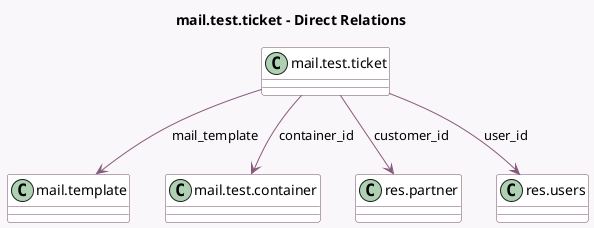

<!-- GENERATED:MODEL -->
---
tags: [odoo, community, generated, model]
---

# mail.test.ticket

- Module: [[docs/Community Addons/test_mail/test_mail|test_mail]]
- Scope: Community Addons
- Defined in module: yes
- Source files: `models/mail_test_ticket.py`
- Python classes: `MailTestTicket`
- Description: Ticket-like model
- Inherits: `mail.thread`

## Field footprint

- Detected fields: 9
- Field types: `Char` x 3, `Datetime` x 1, `Integer` x 1, `Many2one` x 4
- Relation fields: 4

## Sample fields

- `container_id`: `Many2one` (comodel `mail.test.container`)
- `count`: `Integer`
- `customer_id`: `Many2one` (comodel `res.partner`)
- `datetime`: `Datetime`
- `email_from`: `Char`
- `mail_template`: `Many2one` (comodel `mail.template`)
- `name`: `Char`
- `phone_number`: `Char`
- `user_id`: `Many2one` (comodel `res.users`)

## Method hints

- Detected methods: 7
- Action methods: none
- Compute methods: none
- Onchange methods: none

## Direct relation diagram

## Navigation

- **Parent:** [[docs/Community Addons/test_mail/Models]]

<!-- GENERATED:MODEL -->
