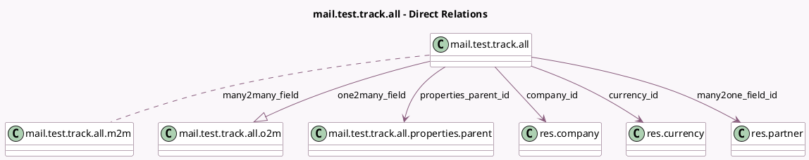

<!-- GENERATED:MODEL -->
---
tags: [odoo, community, generated, model]
---

# mail.test.track.all

- Module: [[docs/Community Addons/test_mail/test_mail|test_mail]]
- Scope: Community Addons
- Defined in module: yes
- Source files: `models/test_mail_corner_case_models.py`
- Python classes: `MailTestTrackAll`
- Description: Test tracking on all field types
- Inherits: `mail.thread`

## Field footprint

- Detected fields: 19
- Field types: `Boolean` x 1, `Char` x 2, `Date` x 1, `Datetime` x 1, `Float` x 2, `Html` x 1, `Integer` x 1, `Many2many` x 1, `Many2one` x 4, `Monetary` x 1, `One2many` x 1, `Properties` x 1, `Selection` x 1, `Text` x 1
- Relation fields: 6

## Sample fields

- `boolean_field`: `Boolean` (comodel `Boolean`)
- `char_field`: `Char` (comodel `Char`)
- `company_id`: `Many2one` (comodel `res.company`)
- `currency_id`: `Many2one` (comodel `res.currency`, related `company_id.currency_id`)
- `date_field`: `Date` (comodel `Date`)
- `datetime_field`: `Datetime` (comodel `Datetime`)
- `float_field`: `Float` (comodel `Float`)
- `float_field_with_digits`: `Float` (comodel `Precise Float`)
- `html_field`: `Html` (comodel `Html`)
- `integer_field`: `Integer` (comodel `Integer`)
- `many2many_field`: `Many2many` (comodel `mail.test.track.all.m2m`)
- `many2one_field_id`: `Many2one` (comodel `res.partner`)
- `monetary_field`: `Monetary` (comodel `Monetary`)
- `name`: `Char` (comodel `Name`)
- `one2many_field`: `One2many` (comodel `mail.test.track.all.o2m`)
- `properties`: `Properties` (comodel `Properties`)
- `properties_parent_id`: `Many2one` (comodel `mail.test.track.all.properties.parent`)
- `selection_field`: `Selection`
- `text_field`: `Text` (comodel `Text`)

## Method hints

- Detected methods: 0
- Action methods: none
- Compute methods: none
- Onchange methods: none

## Direct relation diagram

## Navigation

- **Parent:** [[docs/Community Addons/test_mail/Models]]

<!-- GENERATED:MODEL -->
