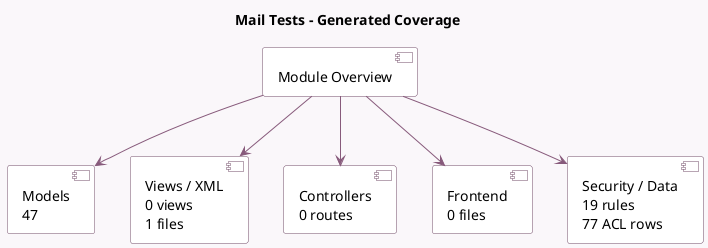

<!-- GENERATED:MODULE -->
---
tags: [odoo, community, module]
---

# Mail Tests

- Scope: Community Addons
- Source: odoo/addons/test_mail
- Dependencies: [[docs/Community Addons/mail/mail|mail]], test_orm (not documented)

## Summary

Mail Tests: performances and tests specific to mail

## Generated coverage

- Models: 47
- XML files with UI/data artifacts: 1
- Views: 0
- Actions: 0
- Menus: 0
- Rules (ir.rule): 19
- Access CSV entries: 77
- Controller units: 0
- Frontend asset files: 0

## Module map

## Detail notes

- Models: [[docs/Community Addons/test_mail/Models|Models]] (47)
- Views and XML: [[docs/Community Addons/test_mail/Views|Views]] (1 files)

## Key models

- `mail.performance.thread`
- `mail.performance.thread.recipients`
- `mail.performance.tracking`
- `mail.test.access`
- `mail.test.access.custo`
- `mail.test.access.public`
- `mail.test.activity`
- `mail.test.alias.optional`
- `mail.test.cc`
- `mail.test.composer.mixin`
- `mail.test.composer.source`
- `mail.test.container`

## Navigation

- [[../Community Addons/Community Addons|Back to scope]]
- [[../../docs/docs|Back to docs]]

<!-- GENERATED:MODULE -->

