<!-- GENERATED:MODEL -->
---
tags: [odoo, community, generated, model]
---

# mail.test.portal

- Module: [[docs/Community Addons/test_mail_full/test_mail_full|test_mail_full]]
- Scope: Community Addons
- Defined in module: yes
- Source files: `models/test_mail_models_mail.py`
- Python classes: `MailTestPortal`
- Description: Chatter Model for Portal
- Inherits: `mail.thread`, `portal.mixin`

## Field footprint

- Detected fields: 3
- Field types: `Char` x 1, `Many2one` x 2
- Relation fields: 2

## Sample fields

- `name`: `Char` (comodel `Name`)
- `partner_id`: `Many2one` (comodel `res.partner`)
- `user_id`: `Many2one` (comodel `res.users`)

## Method hints

- Detected methods: 1
- Action methods: none
- Compute methods: `_compute_access_url`
- Onchange methods: none

## Direct relation diagram

```plantuml
@startuml
!define ODOO_COLOR_PRIMARY #714B67
!define ODOO_COLOR_ACCENT #875A7B
!define ODOO_COLOR_BG #FAF7FA

skinparam backgroundColor ODOO_COLOR_BG
skinparam defaultTextAlignment left
skinparam ArrowColor ODOO_COLOR_ACCENT
skinparam ClassBackgroundColor white
skinparam ClassBorderColor ODOO_COLOR_PRIMARY
skinparam ComponentBackgroundColor white
skinparam ComponentBorderColor ODOO_COLOR_PRIMARY
skinparam NoteBackgroundColor #FFF8FF
skinparam NoteBorderColor ODOO_COLOR_ACCENT
skinparam SequenceLifeLineBorderColor ODOO_COLOR_ACCENT
skinparam SequenceLifeLineBackgroundColor #FFFFFF
skinparam SequenceParticipantBorderColor ODOO_COLOR_PRIMARY
skinparam SequenceParticipantBackgroundColor #FFFFFF
skinparam sequence {
  ArrowColor ODOO_COLOR_ACCENT
  ActorBorderColor ODOO_COLOR_PRIMARY
}
title mail.test.portal - Direct Relations
class "mail.test.portal" as mail_test_portal
class "res.partner" as res_partner
class "res.users" as res_users
mail_test_portal --> res_partner : partner_id
mail_test_portal --> res_users : user_id
@enduml
```

## Navigation

- **Parent:** [[docs/Community Addons/test_mail_full/Models]]

<!-- GENERATED:MODEL -->
