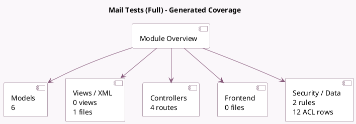

<!-- GENERATED:MODULE -->
---
tags: [odoo, community, module]
---

# Mail Tests (Full)

- Scope: Community Addons
- Source: odoo/addons/test_mail_full
- Dependencies: [[docs/Community Addons/mail/mail|mail]], [[docs/Community Addons/mail_bot/mail_bot|mail_bot]], [[docs/Community Addons/portal/portal|portal]], [[docs/Community Addons/rating/rating|rating]], [[docs/Community Addons/mass_mailing/mass_mailing|mass_mailing]], [[docs/Community Addons/mass_mailing_sms/mass_mailing_sms|mass_mailing_sms]], [[docs/Community Addons/phone_validation/phone_validation|phone_validation]], [[docs/Community Addons/sms/sms|sms]], [[docs/Community Addons/test_mail/test_mail|test_mail]], [[docs/Community Addons/test_mail_sms/test_mail_sms|test_mail_sms]], [[docs/Community Addons/test_mass_mailing/test_mass_mailing|test_mass_mailing]]

## Summary

Mail Tests: performances and tests specific to mail with all sub-modules

## Generated coverage

- Models: 6
- XML files with UI/data artifacts: 1
- Views: 0
- Actions: 0
- Menus: 0
- Rules (ir.rule): 2
- Access CSV entries: 12
- Controller units: 1
- Frontend asset files: 0

## Module map

## Detail notes

- Models: [[docs/Community Addons/test_mail_full/Models|Models]] (6)
- Views and XML: [[docs/Community Addons/test_mail_full/Views|Views]] (1 files)
- Controllers: [[docs/Community Addons/test_mail_full/Controllers|Controllers]] (1)

## Key models

- `mail.test.portal`
- `mail.test.portal.no.partner`
- `mail.test.portal.public.access.action`
- `mail.test.rating`
- `mail.test.rating.thread`
- `mail.test.rating.thread.read`

## Navigation

- [[../Community Addons/Community Addons|Back to scope]]
- [[../../docs/docs|Back to docs]]

<!-- GENERATED:MODULE -->

