<!-- GENERATED:MODEL -->
---
tags: [odoo, community, generated, model]
---

# sms.test.nothread

- Module: [[docs/Community Addons/test_mail_sms/test_mail_sms|test_mail_sms]]
- Scope: Community Addons
- Defined in module: yes
- Source files: `models/test_mail_sms_models.py`
- Python classes: `SMSTestNotMailThread`
- Description: NoThread Model

## Field footprint

- Detected fields: 3
- Field types: `Char` x 1, `Many2one` x 2
- Relation fields: 2

## Sample fields

- `company_id`: `Many2one` (comodel `res.company`)
- `customer_id`: `Many2one` (comodel `res.partner`)
- `name`: `Char`

## Method hints

- Detected methods: 1
- Action methods: none
- Compute methods: none
- Onchange methods: none

## Direct relation diagram

```plantuml
@startuml
!define ODOO_COLOR_PRIMARY #714B67
!define ODOO_COLOR_ACCENT #875A7B
!define ODOO_COLOR_BG #FAF7FA

skinparam backgroundColor ODOO_COLOR_BG
skinparam defaultTextAlignment left
skinparam ArrowColor ODOO_COLOR_ACCENT
skinparam ClassBackgroundColor white
skinparam ClassBorderColor ODOO_COLOR_PRIMARY
skinparam ComponentBackgroundColor white
skinparam ComponentBorderColor ODOO_COLOR_PRIMARY
skinparam NoteBackgroundColor #FFF8FF
skinparam NoteBorderColor ODOO_COLOR_ACCENT
skinparam SequenceLifeLineBorderColor ODOO_COLOR_ACCENT
skinparam SequenceLifeLineBackgroundColor #FFFFFF
skinparam SequenceParticipantBorderColor ODOO_COLOR_PRIMARY
skinparam SequenceParticipantBackgroundColor #FFFFFF
skinparam sequence {
  ArrowColor ODOO_COLOR_ACCENT
  ActorBorderColor ODOO_COLOR_PRIMARY
}
title sms.test.nothread - Direct Relations
class "sms.test.nothread" as sms_test_nothread
class "res.company" as res_company
class "res.partner" as res_partner
sms_test_nothread --> res_company : company_id
sms_test_nothread --> res_partner : customer_id
@enduml
```

## Navigation

- **Parent:** [[docs/Community Addons/test_mail_sms/Models]]

<!-- GENERATED:MODEL -->
