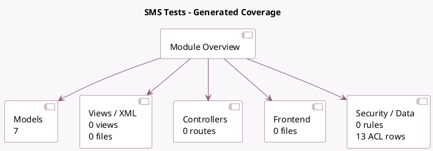

<!-- GENERATED:MODULE -->
---
tags: [odoo, community, module]
---

# SMS Tests

- Scope: Community Addons
- Source: odoo/addons/test_mail_sms
- Dependencies: [[docs/Community Addons/mail/mail|mail]], [[docs/Community Addons/sms/sms|sms]], [[docs/Community Addons/sms_twilio/sms_twilio|sms_twilio]], test_orm (not documented)

## Summary

SMS Tests: performances and tests specific to SMS

## Generated coverage

- Models: 7
- XML files with UI/data artifacts: 0
- Views: 0
- Actions: 0
- Menus: 0
- Rules (ir.rule): 0
- Access CSV entries: 13
- Controller units: 0
- Frontend asset files: 0

## Module map

## Detail notes

- Models: [[docs/Community Addons/test_mail_sms/Models|Models]] (7)

## Key models

- `mail.test.sms`
- `mail.test.sms.bl`
- `mail.test.sms.bl.activity`
- `mail.test.sms.bl.optout`
- `mail.test.sms.partner`
- `mail.test.sms.partner.2many`
- `sms.test.nothread`

## Navigation

- [[../Community Addons/Community Addons|Back to scope]]
- [[../../docs/docs|Back to docs]]

<!-- GENERATED:MODULE -->

