<!-- GENERATED:MODEL -->
---
tags: [odoo, community, generated, model]
---

# mailing.performance.blacklist

- Module: [[docs/Community Addons/test_mass_mailing/test_mass_mailing|test_mass_mailing]]
- Scope: Community Addons
- Defined in module: yes
- Source files: `models/mailing_models.py`
- Python classes: `MailingPerformanceBlacklist`
- Description: Mailing: blacklist performance
- Inherits: `mail.thread.blacklist`

## Field footprint

- Detected fields: 4
- Field types: `Char` x 2, `Many2one` x 2
- Relation fields: 2

## Sample fields

- `container_id`: `Many2one` (comodel `mail.test.container`)
- `email_from`: `Char`
- `name`: `Char`
- `user_id`: `Many2one` (comodel `res.users`)

## Method hints

- Detected methods: 0
- Action methods: none
- Compute methods: none
- Onchange methods: none

## Direct relation diagram

```plantuml
@startuml
!define ODOO_COLOR_PRIMARY #714B67
!define ODOO_COLOR_ACCENT #875A7B
!define ODOO_COLOR_BG #FAF7FA

skinparam backgroundColor ODOO_COLOR_BG
skinparam defaultTextAlignment left
skinparam ArrowColor ODOO_COLOR_ACCENT
skinparam ClassBackgroundColor white
skinparam ClassBorderColor ODOO_COLOR_PRIMARY
skinparam ComponentBackgroundColor white
skinparam ComponentBorderColor ODOO_COLOR_PRIMARY
skinparam NoteBackgroundColor #FFF8FF
skinparam NoteBorderColor ODOO_COLOR_ACCENT
skinparam SequenceLifeLineBorderColor ODOO_COLOR_ACCENT
skinparam SequenceLifeLineBackgroundColor #FFFFFF
skinparam SequenceParticipantBorderColor ODOO_COLOR_PRIMARY
skinparam SequenceParticipantBackgroundColor #FFFFFF
skinparam sequence {
  ArrowColor ODOO_COLOR_ACCENT
  ActorBorderColor ODOO_COLOR_PRIMARY
}
title mailing.performance.blacklist - Direct Relations
class "mailing.performance.blacklist" as mailing_performance_blacklist
class "mail.test.container" as mail_test_container
class "res.users" as res_users
mailing_performance_blacklist --> res_users : user_id
mailing_performance_blacklist --> mail_test_container : container_id
@enduml
```

## Navigation

- **Parent:** [[docs/Community Addons/test_mass_mailing/Models]]

<!-- GENERATED:MODEL -->
