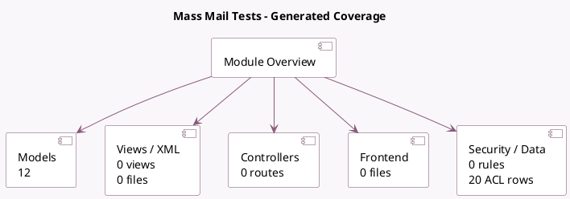

<!-- GENERATED:MODULE -->
---
tags: [odoo, community, module]
---

# Mass Mail Tests

- Scope: Community Addons
- Source: odoo/addons/test_mass_mailing
- Dependencies: [[docs/Community Addons/mass_mailing/mass_mailing|mass_mailing]], [[docs/Community Addons/mass_mailing_sms/mass_mailing_sms|mass_mailing_sms]], [[docs/Community Addons/sms_twilio/sms_twilio|sms_twilio]], [[docs/Community Addons/test_mail/test_mail|test_mail]], [[docs/Community Addons/test_mail_sms/test_mail_sms|test_mail_sms]]

## Summary

Mass Mail Tests: feature and performance tests for mass mailing

## Generated coverage

- Models: 12
- XML files with UI/data artifacts: 0
- Views: 0
- Actions: 0
- Menus: 0
- Rules (ir.rule): 0
- Access CSV entries: 20
- Controller units: 0
- Frontend asset files: 0

## Module map

## Detail notes

- Models: [[docs/Community Addons/test_mass_mailing/Models|Models]] (12)

## Key models

- `ir.qweb`
- `mailing.performance`
- `mailing.performance.blacklist`
- `mailing.test.blacklist`
- `mailing.test.customer`
- `mailing.test.optout`
- `mailing.test.partner`
- `mailing.test.partner.unstored`
- `mailing.test.simple`
- `mailing.test.utm`
- `utm.test.source.mixin`
- `utm.test.source.mixin.other`

## Navigation

- [[../Community Addons/Community Addons|Back to scope]]
- [[../../docs/docs|Back to docs]]

<!-- GENERATED:MODULE -->

