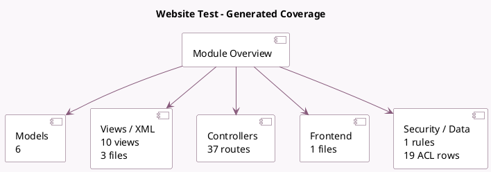

<!-- GENERATED:MODULE -->
---
tags: [odoo, community, module]
---

# Website Test

- Scope: Community Addons
- Source: odoo/addons/test_website
- Dependencies: [[docs/Community Addons/web_unsplash/web_unsplash|web_unsplash]], [[docs/Community Addons/website/website|website]], [[docs/Community Addons/theme_default/theme_default|theme_default]]

## Summary

Website Test, mainly for module install/uninstall tests

## Generated coverage

- Models: 6
- XML files with UI/data artifacts: 3
- Views: 10
- Actions: 4
- Menus: 1
- Rules (ir.rule): 1
- Access CSV entries: 19
- Controller units: 1
- Frontend asset files: 1

## Module map

## Detail notes

- Models: [[docs/Community Addons/test_website/Models|Models]] (6)
- Views and XML: [[docs/Community Addons/test_website/Views|Views]] (3 files)
- Controllers: [[docs/Community Addons/test_website/Controllers|Controllers]] (1)
- Frontend: [[docs/Community Addons/test_website/Frontend|Frontend]] (1 files)

## Key models

- `test.model`
- `test.model.exposed`
- `test.model.multi.website`
- `test.submodel`
- `test.tag`
- `website`

## Navigation

- [[../Community Addons/Community Addons|Back to scope]]
- [[../../docs/docs|Back to docs]]

<!-- GENERATED:MODULE -->

