<!-- GENERATED:MODEL -->
---
tags: [odoo, community, generated, model]
---

# uom.uom

- Module: [[docs/Community Addons/uom/uom|uom]]
- Scope: Community Addons
- Defined in module: yes
- Source files: `models/uom_uom.py`
- Python classes: `UomUom`
- Description: Product Unit of Measure

## Field footprint

- Detected fields: 9
- Field types: `Boolean` x 1, `Char` x 2, `Float` x 3, `Integer` x 1, `Many2one` x 1, `One2many` x 1
- Relation fields: 2

## Sample fields

- `active`: `Boolean` (comodel `Active`)
- `factor`: `Float` (comodel `Absolute Quantity`, compute `_compute_factor`, store `True`)
- `name`: `Char` (comodel `Unit Name`)
- `parent_path`: `Char`
- `related_uom_ids`: `One2many` (comodel `uom.uom`)
- `relative_factor`: `Float` (comodel `Contains`)
- `relative_uom_id`: `Many2one` (comodel `uom.uom`)
- `rounding`: `Float` (comodel `Rounding Precision`, compute `_compute_rounding`)
- `sequence`: `Integer` (compute `_compute_sequence`, store `True`)

## Method hints

- Detected methods: 16
- Action methods: none
- Compute methods: `_compute_display_name`, `_compute_factor`, `_compute_price`, `_compute_quantity`, `_compute_rounding`, `_compute_sequence`
- Onchange methods: `_onchange_critical_fields`

## Direct relation diagram

```plantuml
@startuml
!define ODOO_COLOR_PRIMARY #714B67
!define ODOO_COLOR_ACCENT #875A7B
!define ODOO_COLOR_BG #FAF7FA

skinparam backgroundColor ODOO_COLOR_BG
skinparam defaultTextAlignment left
skinparam ArrowColor ODOO_COLOR_ACCENT
skinparam ClassBackgroundColor white
skinparam ClassBorderColor ODOO_COLOR_PRIMARY
skinparam ComponentBackgroundColor white
skinparam ComponentBorderColor ODOO_COLOR_PRIMARY
skinparam NoteBackgroundColor #FFF8FF
skinparam NoteBorderColor ODOO_COLOR_ACCENT
skinparam SequenceLifeLineBorderColor ODOO_COLOR_ACCENT
skinparam SequenceLifeLineBackgroundColor #FFFFFF
skinparam SequenceParticipantBorderColor ODOO_COLOR_PRIMARY
skinparam SequenceParticipantBackgroundColor #FFFFFF
skinparam sequence {
  ArrowColor ODOO_COLOR_ACCENT
  ActorBorderColor ODOO_COLOR_PRIMARY
}
title uom.uom - Direct Relations
class "uom.uom" as uom_uom
class "uom.uom" as uom_uom
uom_uom --> uom_uom : relative_uom_id
uom_uom --|> uom_uom : related_uom_ids
@enduml
```

## Navigation

- **Parent:** [[docs/Community Addons/uom/Models]]

<!-- GENERATED:MODEL -->
