<!-- GENERATED:MODEL -->
---
tags: [odoo, community, generated, model]
---

# utm.campaign

- Module: [[docs/Community Addons/utm/utm|utm]]
- Scope: Community Addons
- Defined in module: yes
- Source files: `models/utm_campaign.py`
- Python classes: `UtmCampaign`
- Description: UTM Campaign

## Field footprint

- Detected fields: 8
- Field types: `Boolean` x 2, `Char` x 2, `Integer` x 1, `Many2many` x 1, `Many2one` x 2
- Relation fields: 3

## Sample fields

- `active`: `Boolean` (comodel `Active`)
- `color`: `Integer`
- `is_auto_campaign`: `Boolean`
- `name`: `Char` (compute `_compute_name`, store `True`)
- `stage_id`: `Many2one` (comodel `utm.stage`)
- `tag_ids`: `Many2many` (comodel `utm.tag`)
- `title`: `Char`
- `user_id`: `Many2one` (comodel `res.users`)

## Method hints

- Detected methods: 3
- Action methods: none
- Compute methods: `_compute_name`
- Onchange methods: none

## Direct relation diagram

```plantuml
@startuml
!define ODOO_COLOR_PRIMARY #714B67
!define ODOO_COLOR_ACCENT #875A7B
!define ODOO_COLOR_BG #FAF7FA

skinparam backgroundColor ODOO_COLOR_BG
skinparam defaultTextAlignment left
skinparam ArrowColor ODOO_COLOR_ACCENT
skinparam ClassBackgroundColor white
skinparam ClassBorderColor ODOO_COLOR_PRIMARY
skinparam ComponentBackgroundColor white
skinparam ComponentBorderColor ODOO_COLOR_PRIMARY
skinparam NoteBackgroundColor #FFF8FF
skinparam NoteBorderColor ODOO_COLOR_ACCENT
skinparam SequenceLifeLineBorderColor ODOO_COLOR_ACCENT
skinparam SequenceLifeLineBackgroundColor #FFFFFF
skinparam SequenceParticipantBorderColor ODOO_COLOR_PRIMARY
skinparam SequenceParticipantBackgroundColor #FFFFFF
skinparam sequence {
  ArrowColor ODOO_COLOR_ACCENT
  ActorBorderColor ODOO_COLOR_PRIMARY
}
title utm.campaign - Direct Relations
class "utm.campaign" as utm_campaign
class "res.users" as res_users
class "utm.stage" as utm_stage
class "utm.tag" as utm_tag
utm_campaign --> res_users : user_id
utm_campaign --> utm_stage : stage_id
utm_campaign .. utm_tag : tag_ids
@enduml
```

## Navigation

- **Parent:** [[docs/Community Addons/utm/Models]]

<!-- GENERATED:MODEL -->
