<!-- GENERATED:MODEL -->
---
tags: [odoo, community, generated, model]
---

# utm.mixin

- Module: [[docs/Community Addons/utm/utm|utm]]
- Scope: Community Addons
- Defined in module: yes
- Source files: `models/utm_mixin.py`
- Python classes: `UtmMixin`
- Description: UTM Mixin

## Field footprint

- Detected fields: 3
- Field types: `Many2one` x 3
- Relation fields: 3

## Sample fields

- `campaign_id`: `Many2one` (comodel `utm.campaign`)
- `medium_id`: `Many2one` (comodel `utm.medium`)
- `source_id`: `Many2one` (comodel `utm.source`)

## Method hints

- Detected methods: 7
- Action methods: none
- Compute methods: none
- Onchange methods: none

## Direct relation diagram

```plantuml
@startuml
!define ODOO_COLOR_PRIMARY #714B67
!define ODOO_COLOR_ACCENT #875A7B
!define ODOO_COLOR_BG #FAF7FA

skinparam backgroundColor ODOO_COLOR_BG
skinparam defaultTextAlignment left
skinparam ArrowColor ODOO_COLOR_ACCENT
skinparam ClassBackgroundColor white
skinparam ClassBorderColor ODOO_COLOR_PRIMARY
skinparam ComponentBackgroundColor white
skinparam ComponentBorderColor ODOO_COLOR_PRIMARY
skinparam NoteBackgroundColor #FFF8FF
skinparam NoteBorderColor ODOO_COLOR_ACCENT
skinparam SequenceLifeLineBorderColor ODOO_COLOR_ACCENT
skinparam SequenceLifeLineBackgroundColor #FFFFFF
skinparam SequenceParticipantBorderColor ODOO_COLOR_PRIMARY
skinparam SequenceParticipantBackgroundColor #FFFFFF
skinparam sequence {
  ArrowColor ODOO_COLOR_ACCENT
  ActorBorderColor ODOO_COLOR_PRIMARY
}
title utm.mixin - Direct Relations
class "utm.mixin" as utm_mixin
class "utm.campaign" as utm_campaign
class "utm.medium" as utm_medium
class "utm.source" as utm_source
utm_mixin --> utm_campaign : campaign_id
utm_mixin --> utm_source : source_id
utm_mixin --> utm_medium : medium_id
@enduml
```

## Navigation

- **Parent:** [[docs/Community Addons/utm/Models]]

<!-- GENERATED:MODEL -->
