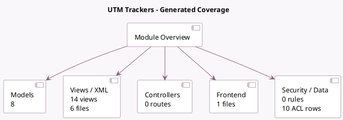

<!-- GENERATED:MODULE -->
---
tags: [odoo, community, module]
---

# UTM Trackers

- Scope: Community Addons
- Source: odoo/addons/utm
- Dependencies: base (not documented), [[docs/Community Addons/web/web|web]]

## Generated coverage

- Models: 8
- XML files with UI/data artifacts: 6
- Views: 14
- Actions: 5
- Menus: 5
- Rules (ir.rule): 0
- Access CSV entries: 10
- Controller units: 0
- Frontend asset files: 1

## Module map

## Detail notes

- Models: [[docs/Community Addons/utm/Models|Models]] (8)
- Views and XML: [[docs/Community Addons/utm/Views|Views]] (6 files)
- Frontend: [[docs/Community Addons/utm/Frontend|Frontend]] (1 files)

## Key models

- `ir.http`
- `utm.campaign`
- `utm.medium`
- `utm.mixin`
- `utm.source`
- `utm.source.mixin`
- `utm.stage`
- `utm.tag`

## Navigation

- [[../Community Addons/Community Addons|Back to scope]]
- [[../../docs/docs|Back to docs]]

<!-- GENERATED:MODULE -->

