<!-- GENERATED:MODEL -->
---
tags: [odoo, community, generated, model]
---

# base.document.layout

- Module: [[docs/Community Addons/web/web|web]]
- Scope: Community Addons
- Defined in module: yes
- Source files: `models/base_document_layout.py`
- Python classes: `BaseDocumentLayout`
- Description: Company Document Layout

## Field footprint

- Detected fields: 26
- Field types: `Binary` x 3, `Boolean` x 2, `Char` x 9, `Html` x 4, `Many2one` x 6, `Selection` x 2
- Relation fields: 6

## Sample fields

- `company_details`: `Html` (related `company_id.company_details`)
- `company_id`: `Many2one` (comodel `res.company`)
- `country_id`: `Many2one` (related `company_id.country_id`)
- `custom_colors`: `Boolean` (compute `_compute_custom_colors`)
- `email`: `Char` (related `company_id.email`)
- `external_report_layout_id`: `Many2one` (related `company_id.external_report_layout_id`)
- `font`: `Selection` (related `company_id.font`)
- `is_company_details_empty`: `Boolean` (compute `_compute_empty_company_details`)
- `layout_background`: `Selection` (related `company_id.layout_background`)
- `layout_background_image`: `Binary` (related `company_id.layout_background_image`)
- `logo`: `Binary` (related `company_id.logo`)
- `logo_primary_color`: `Char` (compute `_compute_logo_colors`)
- `logo_secondary_color`: `Char` (compute `_compute_logo_colors`)
- `name`: `Char` (related `company_id.name`)
- `paperformat_id`: `Many2one` (related `company_id.paperformat_id`)
- `partner_id`: `Many2one` (related `company_id.partner_id`)
- `phone`: `Char` (related `company_id.phone`)
- `preview`: `Html` (compute `_compute_preview`)
- `preview_logo`: `Binary` (related `logo`)
- `primary_color`: `Char` (related `company_id.primary_color`)

## Method hints

- Detected methods: 17
- Action methods: none
- Compute methods: `_compute_custom_colors`, `_compute_empty_company_details`, `_compute_logo_colors`, `_compute_preview`
- Onchange methods: `_onchange_company_id`, `_onchange_custom_colors`, `_onchange_logo`, `_onchange_report_layout_id`

## Direct relation diagram

```plantuml
@startuml
!define ODOO_COLOR_PRIMARY #714B67
!define ODOO_COLOR_ACCENT #875A7B
!define ODOO_COLOR_BG #FAF7FA

skinparam backgroundColor ODOO_COLOR_BG
skinparam defaultTextAlignment left
skinparam ArrowColor ODOO_COLOR_ACCENT
skinparam ClassBackgroundColor white
skinparam ClassBorderColor ODOO_COLOR_PRIMARY
skinparam ComponentBackgroundColor white
skinparam ComponentBorderColor ODOO_COLOR_PRIMARY
skinparam NoteBackgroundColor #FFF8FF
skinparam NoteBorderColor ODOO_COLOR_ACCENT
skinparam SequenceLifeLineBorderColor ODOO_COLOR_ACCENT
skinparam SequenceLifeLineBackgroundColor #FFFFFF
skinparam SequenceParticipantBorderColor ODOO_COLOR_PRIMARY
skinparam SequenceParticipantBackgroundColor #FFFFFF
skinparam sequence {
  ArrowColor ODOO_COLOR_ACCENT
  ActorBorderColor ODOO_COLOR_PRIMARY
}
title base.document.layout - Direct Relations
class "base.document.layout" as base_document_layout
class "report.layout" as report_layout
class "res.company" as res_company
base_document_layout --> res_company : company_id
base_document_layout --> report_layout : report_layout_id
@enduml
```

## Navigation

- **Parent:** [[docs/Community Addons/web/Models]]

<!-- GENERATED:MODEL -->
