<!-- GENERATED:MODEL -->
---
tags: [odoo, community, generated, model]
---

# res.users.settings.embedded.action

- Module: [[docs/Community Addons/web/web|web]]
- Scope: Community Addons
- Defined in module: yes
- Source files: `models/res_users_settings_embedded_action.py`
- Python classes: `ResUsersSettingsEmbeddedAction`
- Description: User Settings for Embedded Actions

## Field footprint

- Detected fields: 7
- Field types: `Boolean` x 1, `Char` x 3, `Integer` x 1, `Many2one` x 2
- Relation fields: 2

## Sample fields

- `action_id`: `Many2one` (comodel `ir.actions.act_window`)
- `embedded_actions_order`: `Char` (comodel `List order of embedded action ids`)
- `embedded_actions_visibility`: `Char` (comodel `List visibility of embedded actions ids`)
- `embedded_visibility`: `Boolean` (comodel `Is top bar visible`)
- `res_id`: `Integer`
- `res_model`: `Char`
- `user_setting_id`: `Many2one` (comodel `res.users.settings`)

## Method hints

- Detected methods: 4
- Action methods: none
- Compute methods: none
- Onchange methods: none

## Direct relation diagram

```plantuml
@startuml
!define ODOO_COLOR_PRIMARY #714B67
!define ODOO_COLOR_ACCENT #875A7B
!define ODOO_COLOR_BG #FAF7FA

skinparam backgroundColor ODOO_COLOR_BG
skinparam defaultTextAlignment left
skinparam ArrowColor ODOO_COLOR_ACCENT
skinparam ClassBackgroundColor white
skinparam ClassBorderColor ODOO_COLOR_PRIMARY
skinparam ComponentBackgroundColor white
skinparam ComponentBorderColor ODOO_COLOR_PRIMARY
skinparam NoteBackgroundColor #FFF8FF
skinparam NoteBorderColor ODOO_COLOR_ACCENT
skinparam SequenceLifeLineBorderColor ODOO_COLOR_ACCENT
skinparam SequenceLifeLineBackgroundColor #FFFFFF
skinparam SequenceParticipantBorderColor ODOO_COLOR_PRIMARY
skinparam SequenceParticipantBackgroundColor #FFFFFF
skinparam sequence {
  ArrowColor ODOO_COLOR_ACCENT
  ActorBorderColor ODOO_COLOR_PRIMARY
}
title res.users.settings.embedded.action - Direct Relations
class "res.users.settings.embedded.action" as res_users_settings_embedded_action
class "ir.actions.act_window" as ir_actions_act_window
class "res.users.settings" as res_users_settings
res_users_settings_embedded_action --> res_users_settings : user_setting_id
res_users_settings_embedded_action --> ir_actions_act_window : action_id
@enduml
```

## Navigation

- **Parent:** [[docs/Community Addons/web/Models]]

<!-- GENERATED:MODEL -->
