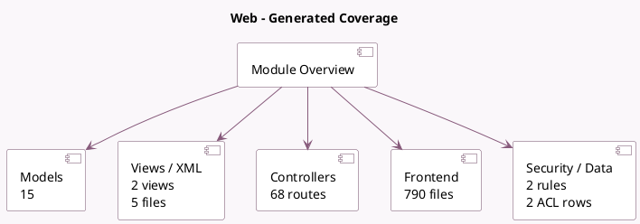

<!-- GENERATED:MODULE -->
---
tags: [odoo, community, module]
---

# Web

- Scope: Community Addons
- Source: odoo/addons/web
- Dependencies: base (not documented)

## Generated coverage

- Models: 15
- XML files with UI/data artifacts: 5
- Views: 2
- Actions: 5
- Menus: 0
- Rules (ir.rule): 2
- Access CSV entries: 2
- Controller units: 19
- Frontend asset files: 790

## Module map

## Detail notes

- Models: [[docs/Community Addons/web/Models|Models]] (15)
- Views and XML: [[docs/Community Addons/web/Views|Views]] (5 files)
- Controllers: [[docs/Community Addons/web/Controllers|Controllers]] (19)
- Frontend: [[docs/Community Addons/web/Frontend|Frontend]] (790 files)

## Key models

- `base`
- `base.document.layout`
- `ir.http`
- `ir.model`
- `ir.qweb.field.image`
- `ir.qweb.field.image_url`
- `ir.ui.menu`
- `ir.ui.view`
- `properties.base.definition`
- `res.company`
- `res.config.settings`
- `res.partner`

## Navigation

- [[../Community Addons/Community Addons|Back to scope]]
- [[../../docs/docs|Back to docs]]

<!-- GENERATED:MODULE -->

