<!-- GENERATED:MODEL -->
---
tags: [odoo, community, generated, model]
---

# web_tour.tour

- Module: [[docs/Community Addons/web_tour/web_tour|web_tour]]
- Scope: Community Addons
- Defined in module: yes
- Source files: `models/tour.py`
- Python classes: `Web_TourTour`
- Description: Tours

## Field footprint

- Detected fields: 8
- Field types: `Boolean` x 1, `Char` x 3, `Html` x 1, `Integer` x 1, `Many2many` x 1, `One2many` x 1
- Relation fields: 2

## Sample fields

- `custom`: `Boolean`
- `name`: `Char`
- `rainbow_man_message`: `Html`
- `sequence`: `Integer`
- `sharing_url`: `Char` (compute `_compute_sharing_url`)
- `step_ids`: `One2many` (comodel `web_tour.tour.step`)
- `url`: `Char`
- `user_consumed_ids`: `Many2many` (comodel `res.users`)

## Method hints

- Detected methods: 6
- Action methods: none
- Compute methods: `_compute_sharing_url`
- Onchange methods: none

## Direct relation diagram

```plantuml
@startuml
!define ODOO_COLOR_PRIMARY #714B67
!define ODOO_COLOR_ACCENT #875A7B
!define ODOO_COLOR_BG #FAF7FA

skinparam backgroundColor ODOO_COLOR_BG
skinparam defaultTextAlignment left
skinparam ArrowColor ODOO_COLOR_ACCENT
skinparam ClassBackgroundColor white
skinparam ClassBorderColor ODOO_COLOR_PRIMARY
skinparam ComponentBackgroundColor white
skinparam ComponentBorderColor ODOO_COLOR_PRIMARY
skinparam NoteBackgroundColor #FFF8FF
skinparam NoteBorderColor ODOO_COLOR_ACCENT
skinparam SequenceLifeLineBorderColor ODOO_COLOR_ACCENT
skinparam SequenceLifeLineBackgroundColor #FFFFFF
skinparam SequenceParticipantBorderColor ODOO_COLOR_PRIMARY
skinparam SequenceParticipantBackgroundColor #FFFFFF
skinparam sequence {
  ArrowColor ODOO_COLOR_ACCENT
  ActorBorderColor ODOO_COLOR_PRIMARY
}
title web_tour.tour - Direct Relations
class "web_tour.tour" as web_tour_tour
class "res.users" as res_users
class "web_tour.tour.step" as web_tour_tour_step
web_tour_tour --|> web_tour_tour_step : step_ids
web_tour_tour .. res_users : user_consumed_ids
@enduml
```

## Navigation

- **Parent:** [[docs/Community Addons/web_tour/Models]]

<!-- GENERATED:MODEL -->
