<!-- GENERATED:MODEL -->
---
tags: [odoo, community, generated, model]
---

# web_tour.tour.step

- Module: [[docs/Community Addons/web_tour/web_tour|web_tour]]
- Scope: Community Addons
- Defined in module: yes
- Source files: `models/tour.py`
- Python classes: `Web_TourTourStep`
- Description: Tour's step

## Field footprint

- Detected fields: 6
- Field types: `Char` x 3, `Integer` x 1, `Many2one` x 1, `Selection` x 1
- Relation fields: 1

## Sample fields

- `content`: `Char`
- `run`: `Char`
- `sequence`: `Integer`
- `tooltip_position`: `Selection`
- `tour_id`: `Many2one` (comodel `web_tour.tour`)
- `trigger`: `Char`

## Method hints

- Detected methods: 1
- Action methods: none
- Compute methods: none
- Onchange methods: none

## Direct relation diagram

```plantuml
@startuml
!define ODOO_COLOR_PRIMARY #714B67
!define ODOO_COLOR_ACCENT #875A7B
!define ODOO_COLOR_BG #FAF7FA

skinparam backgroundColor ODOO_COLOR_BG
skinparam defaultTextAlignment left
skinparam ArrowColor ODOO_COLOR_ACCENT
skinparam ClassBackgroundColor white
skinparam ClassBorderColor ODOO_COLOR_PRIMARY
skinparam ComponentBackgroundColor white
skinparam ComponentBorderColor ODOO_COLOR_PRIMARY
skinparam NoteBackgroundColor #FFF8FF
skinparam NoteBorderColor ODOO_COLOR_ACCENT
skinparam SequenceLifeLineBorderColor ODOO_COLOR_ACCENT
skinparam SequenceLifeLineBackgroundColor #FFFFFF
skinparam SequenceParticipantBorderColor ODOO_COLOR_PRIMARY
skinparam SequenceParticipantBackgroundColor #FFFFFF
skinparam sequence {
  ArrowColor ODOO_COLOR_ACCENT
  ActorBorderColor ODOO_COLOR_PRIMARY
}
title web_tour.tour.step - Direct Relations
class "web_tour.tour.step" as web_tour_tour_step
class "web_tour.tour" as web_tour_tour
web_tour_tour_step --> web_tour_tour : tour_id
@enduml
```

## Navigation

- **Parent:** [[docs/Community Addons/web_tour/Models]]

<!-- GENERATED:MODEL -->
