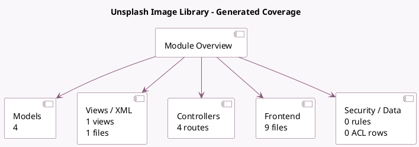

<!-- GENERATED:MODULE -->
---
tags: [odoo, community, module]
---

# Unsplash Image Library

- Scope: Community Addons
- Source: odoo/addons/web_unsplash
- Dependencies: [[docs/Community Addons/base_setup/base_setup|base_setup]], [[docs/Community Addons/html_editor/html_editor|html_editor]]

## Summary

Find free high-resolution images from Unsplash

## Generated coverage

- Models: 4
- XML files with UI/data artifacts: 1
- Views: 1
- Actions: 0
- Menus: 0
- Rules (ir.rule): 0
- Access CSV entries: 0
- Controller units: 1
- Frontend asset files: 9

## Module map

## Detail notes

- Models: [[docs/Community Addons/web_unsplash/Models|Models]] (4)
- Views and XML: [[docs/Community Addons/web_unsplash/Views|Views]] (1 files)
- Controllers: [[docs/Community Addons/web_unsplash/Controllers|Controllers]] (1)
- Frontend: [[docs/Community Addons/web_unsplash/Frontend|Frontend]] (9 files)

## Key models

- `ir.attachment`
- `ir.qweb.field.image`
- `res.config.settings`
- `res.users`

## Navigation

- [[../Community Addons/Community Addons|Back to scope]]
- [[../../docs/docs|Back to docs]]

<!-- GENERATED:MODULE -->

