<!-- GENERATED:MODEL -->
---
tags: [odoo, community, generated, model]
---

# ir.asset

- Module: [[docs/Community Addons/website/website|website]]
- Scope: Community Addons
- Defined in module: extension only
- Source files: `models/ir_asset.py`, `models/theme_models.py`
- Python classes: `IrAsset`

## Field footprint

- Detected fields: 3
- Field types: `Char` x 1, `Many2one` x 2
- Relation fields: 2

## Sample fields

- `key`: `Char`
- `theme_template_id`: `Many2one` (comodel `theme.ir.asset`)
- `website_id`: `Many2one` (comodel `website`)

## Method hints

- Detected methods: 6
- Action methods: none
- Compute methods: none
- Onchange methods: none

## Direct relation diagram

```plantuml
@startuml
!define ODOO_COLOR_PRIMARY #714B67
!define ODOO_COLOR_ACCENT #875A7B
!define ODOO_COLOR_BG #FAF7FA

skinparam backgroundColor ODOO_COLOR_BG
skinparam defaultTextAlignment left
skinparam ArrowColor ODOO_COLOR_ACCENT
skinparam ClassBackgroundColor white
skinparam ClassBorderColor ODOO_COLOR_PRIMARY
skinparam ComponentBackgroundColor white
skinparam ComponentBorderColor ODOO_COLOR_PRIMARY
skinparam NoteBackgroundColor #FFF8FF
skinparam NoteBorderColor ODOO_COLOR_ACCENT
skinparam SequenceLifeLineBorderColor ODOO_COLOR_ACCENT
skinparam SequenceLifeLineBackgroundColor #FFFFFF
skinparam SequenceParticipantBorderColor ODOO_COLOR_PRIMARY
skinparam SequenceParticipantBackgroundColor #FFFFFF
skinparam sequence {
  ArrowColor ODOO_COLOR_ACCENT
  ActorBorderColor ODOO_COLOR_PRIMARY
}
title ir.asset - Direct Relations
class "ir.asset" as ir_asset
class "theme.ir.asset" as theme_ir_asset
class "website" as website
ir_asset --> website : website_id
ir_asset --> theme_ir_asset : theme_template_id
@enduml
```

## Navigation

- **Parent:** [[docs/Community Addons/website/Models]]

<!-- GENERATED:MODEL -->
