<!-- GENERATED:MODEL -->
---
tags: [odoo, community, generated, model]
---

# ir.model

- Module: [[docs/Community Addons/website/website|website]]
- Scope: Community Addons
- Defined in module: yes
- Source files: `models/website_form.py`
- Python classes: `IrModel`
- Description: Models

## Field footprint

- Detected fields: 4
- Field types: `Boolean` x 1, `Char` x 2, `Many2one` x 1
- Relation fields: 1

## Sample fields

- `website_form_access`: `Boolean` (comodel `Allowed to use in forms`)
- `website_form_default_field_id`: `Many2one` (comodel `ir.model.fields`)
- `website_form_key`: `Char`
- `website_form_label`: `Char` (comodel `Label for form action`)

## Method hints

- Detected methods: 3
- Action methods: none
- Compute methods: none
- Onchange methods: none

## Direct relation diagram

```plantuml
@startuml
!define ODOO_COLOR_PRIMARY #714B67
!define ODOO_COLOR_ACCENT #875A7B
!define ODOO_COLOR_BG #FAF7FA

skinparam backgroundColor ODOO_COLOR_BG
skinparam defaultTextAlignment left
skinparam ArrowColor ODOO_COLOR_ACCENT
skinparam ClassBackgroundColor white
skinparam ClassBorderColor ODOO_COLOR_PRIMARY
skinparam ComponentBackgroundColor white
skinparam ComponentBorderColor ODOO_COLOR_PRIMARY
skinparam NoteBackgroundColor #FFF8FF
skinparam NoteBorderColor ODOO_COLOR_ACCENT
skinparam SequenceLifeLineBorderColor ODOO_COLOR_ACCENT
skinparam SequenceLifeLineBackgroundColor #FFFFFF
skinparam SequenceParticipantBorderColor ODOO_COLOR_PRIMARY
skinparam SequenceParticipantBackgroundColor #FFFFFF
skinparam sequence {
  ArrowColor ODOO_COLOR_ACCENT
  ActorBorderColor ODOO_COLOR_PRIMARY
}
title ir.model - Direct Relations
class "ir.model" as ir_model
class "ir.model.fields" as ir_model_fields
ir_model --> ir_model_fields : website_form_default_field_id
@enduml
```

## Navigation

- **Parent:** [[docs/Community Addons/website/Models]]

<!-- GENERATED:MODEL -->
