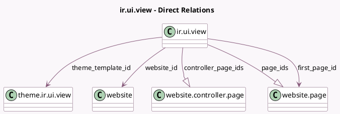

<!-- GENERATED:MODEL -->
---
tags: [odoo, community, generated, model]
---

# ir.ui.view

- Module: [[docs/Community Addons/website/website|website]]
- Scope: Community Addons
- Defined in module: yes
- Source files: `models/ir_ui_view.py`, `models/theme_models.py`
- Python classes: `IrUiView`
- Inherits: `website.seo.metadata`

## Field footprint

- Detected fields: 9
- Field types: `Boolean` x 1, `Char` x 2, `Many2one` x 3, `One2many` x 2, `Selection` x 1
- Relation fields: 5

## Sample fields

- `controller_page_ids`: `One2many` (comodel `website.controller.page`)
- `first_page_id`: `Many2one` (comodel `website.page`, compute `_compute_first_page_id`)
- `page_ids`: `One2many` (comodel `website.page`)
- `theme_template_id`: `Many2one` (comodel `theme.ir.ui.view`)
- `track`: `Boolean`
- `visibility`: `Selection`
- `visibility_password`: `Char`
- `visibility_password_display`: `Char` (compute `_get_pwd`)
- `website_id`: `Many2one` (comodel `website`)

## Method hints

- Detected methods: 36
- Action methods: none
- Compute methods: `_compute_display_name`, `_compute_first_page_id`
- Onchange methods: none

## Direct relation diagram

## Navigation

- **Parent:** [[docs/Community Addons/website/Models]]

<!-- GENERATED:MODEL -->
