<!-- GENERATED:MODEL -->
---
tags: [odoo, community, generated, model]
---

# res.config.settings

- Module: [[docs/Community Addons/website/website|website]]
- Scope: Community Addons
- Defined in module: extension only
- Source files: `models/res_config_settings.py`
- Python classes: `ResConfigSettings`

## Field footprint

- Detected fields: 29
- Field types: `Binary` x 3, `Boolean` x 10, `Char` x 9, `Integer` x 1, `Many2many` x 1, `Many2one` x 3, `Selection` x 1, `Text` x 1
- Relation fields: 4

## Sample fields

- `auth_signup_uninvited`: `Selection` (compute `_compute_auth_signup_uninvited`)
- `cdn_activated`: `Boolean` (related `website_id.cdn_activated`)
- `cdn_filters`: `Text` (related `website_id.cdn_filters`)
- `cdn_url`: `Char` (related `website_id.cdn_url`)
- `favicon`: `Binary` (comodel `Favicon`, related `website_id.favicon`)
- `google_analytics_key`: `Char` (comodel `Google Analytics Key`, related `website_id.google_analytics_key`)
- `google_search_console`: `Char` (comodel `Google Search Console Key`, related `website_id.google_search_console`)
- `group_multi_website`: `Boolean` (comodel `Multi-website`)
- `has_default_share_image`: `Boolean` (comodel `Use a image by default for sharing`, compute `_compute_has_default_share_image`)
- `has_google_analytics`: `Boolean` (comodel `Google Analytics`, compute `_compute_has_google_analytics`)
- `has_google_search_console`: `Boolean` (comodel `Google Search Console`, compute `_compute_has_google_search_console`)
- `has_plausible_shared_key`: `Boolean` (comodel `Plausible Analytics`, compute `_compute_has_plausible_shared_key`)
- `language_ids`: `Many2many` (related `website_id.language_ids`)
- `module_website_livechat`: `Boolean`
- `plausible_shared_key`: `Char` (comodel `Plausible auth Key`, related `website_id.plausible_shared_key`)
- `plausible_site`: `Char` (comodel `Plausible Site (e.g. domain.com)`, related `website_id.plausible_site`)
- `shared_user_account`: `Boolean` (compute `_compute_shared_user_account`)
- `social_default_image`: `Binary` (comodel `Default Social Share Image`, related `website_id.social_default_image`)
- `website_block_third_party_domains`: `Boolean` (comodel `Block 3rd-party domains`, related `website_id.block_third_party_domains`)
- `website_company_id`: `Many2one` (related `website_id.company_id`)

## Method hints

- Detected methods: 18
- Action methods: `action_open_blocked_third_party_domains`, `action_open_robots`, `action_website_create_new`
- Compute methods: `_compute_auth_signup_uninvited`, `_compute_has_default_share_image`, `_compute_has_google_analytics`, `_compute_has_google_search_console`, `_compute_has_plausible_shared_key`, `_compute_shared_user_account`
- Onchange methods: `_onchange_language_ids`, `_onchange_shared_key`

## Direct relation diagram

```plantuml
@startuml
!define ODOO_COLOR_PRIMARY #714B67
!define ODOO_COLOR_ACCENT #875A7B
!define ODOO_COLOR_BG #FAF7FA

skinparam backgroundColor ODOO_COLOR_BG
skinparam defaultTextAlignment left
skinparam ArrowColor ODOO_COLOR_ACCENT
skinparam ClassBackgroundColor white
skinparam ClassBorderColor ODOO_COLOR_PRIMARY
skinparam ComponentBackgroundColor white
skinparam ComponentBorderColor ODOO_COLOR_PRIMARY
skinparam NoteBackgroundColor #FFF8FF
skinparam NoteBorderColor ODOO_COLOR_ACCENT
skinparam SequenceLifeLineBorderColor ODOO_COLOR_ACCENT
skinparam SequenceLifeLineBackgroundColor #FFFFFF
skinparam SequenceParticipantBorderColor ODOO_COLOR_PRIMARY
skinparam SequenceParticipantBackgroundColor #FFFFFF
skinparam sequence {
  ArrowColor ODOO_COLOR_ACCENT
  ActorBorderColor ODOO_COLOR_PRIMARY
}
title res.config.settings - Direct Relations
class "res.config.settings" as res_config_settings
class "website" as website
res_config_settings --> website : website_id
@enduml
```

## Navigation

- **Parent:** [[docs/Community Addons/website/Models]]

<!-- GENERATED:MODEL -->
