<!-- GENERATED:MODEL -->
---
tags: [odoo, community, generated, model]
---

# theme.ir.asset

- Module: [[docs/Community Addons/website/website|website]]
- Scope: Community Addons
- Defined in module: yes
- Source files: `models/theme_models.py`
- Python classes: `ThemeIrAsset`
- Description: Theme Asset

## Field footprint

- Detected fields: 9
- Field types: `Boolean` x 1, `Char` x 5, `Integer` x 1, `One2many` x 1, `Selection` x 1
- Relation fields: 1

## Sample fields

- `active`: `Boolean`
- `bundle`: `Char`
- `copy_ids`: `One2many` (comodel `ir.asset`)
- `directive`: `Selection`
- `key`: `Char`
- `name`: `Char`
- `path`: `Char`
- `sequence`: `Integer`
- `target`: `Char`

## Method hints

- Detected methods: 1
- Action methods: none
- Compute methods: none
- Onchange methods: none

## Direct relation diagram

```plantuml
@startuml
!define ODOO_COLOR_PRIMARY #714B67
!define ODOO_COLOR_ACCENT #875A7B
!define ODOO_COLOR_BG #FAF7FA

skinparam backgroundColor ODOO_COLOR_BG
skinparam defaultTextAlignment left
skinparam ArrowColor ODOO_COLOR_ACCENT
skinparam ClassBackgroundColor white
skinparam ClassBorderColor ODOO_COLOR_PRIMARY
skinparam ComponentBackgroundColor white
skinparam ComponentBorderColor ODOO_COLOR_PRIMARY
skinparam NoteBackgroundColor #FFF8FF
skinparam NoteBorderColor ODOO_COLOR_ACCENT
skinparam SequenceLifeLineBorderColor ODOO_COLOR_ACCENT
skinparam SequenceLifeLineBackgroundColor #FFFFFF
skinparam SequenceParticipantBorderColor ODOO_COLOR_PRIMARY
skinparam SequenceParticipantBackgroundColor #FFFFFF
skinparam sequence {
  ArrowColor ODOO_COLOR_ACCENT
  ActorBorderColor ODOO_COLOR_PRIMARY
}
title theme.ir.asset - Direct Relations
class "theme.ir.asset" as theme_ir_asset
class "ir.asset" as ir_asset
theme_ir_asset --|> ir_asset : copy_ids
@enduml
```

## Navigation

- **Parent:** [[docs/Community Addons/website/Models]]

<!-- GENERATED:MODEL -->
