<!-- GENERATED:MODEL -->
---
tags: [odoo, community, generated, model]
---

# theme.website.menu

- Module: [[docs/Community Addons/website/website|website]]
- Scope: Community Addons
- Defined in module: yes
- Source files: `models/theme_models.py`
- Python classes: `ThemeWebsiteMenu`
- Description: Website Theme Menu

## Field footprint

- Detected fields: 10
- Field types: `Boolean` x 2, `Char` x 3, `Html` x 1, `Integer` x 1, `Many2one` x 2, `One2many` x 1
- Relation fields: 3

## Sample fields

- `copy_ids`: `One2many` (comodel `website.menu`)
- `mega_menu_classes`: `Char`
- `mega_menu_content`: `Html`
- `name`: `Char`
- `new_window`: `Boolean` (comodel `New Window`)
- `page_id`: `Many2one` (comodel `theme.website.page`)
- `parent_id`: `Many2one` (comodel `theme.website.menu`)
- `sequence`: `Integer`
- `url`: `Char`
- `use_main_menu_as_parent`: `Boolean`

## Method hints

- Detected methods: 1
- Action methods: none
- Compute methods: none
- Onchange methods: none

## Direct relation diagram

```plantuml
@startuml
!define ODOO_COLOR_PRIMARY #714B67
!define ODOO_COLOR_ACCENT #875A7B
!define ODOO_COLOR_BG #FAF7FA

skinparam backgroundColor ODOO_COLOR_BG
skinparam defaultTextAlignment left
skinparam ArrowColor ODOO_COLOR_ACCENT
skinparam ClassBackgroundColor white
skinparam ClassBorderColor ODOO_COLOR_PRIMARY
skinparam ComponentBackgroundColor white
skinparam ComponentBorderColor ODOO_COLOR_PRIMARY
skinparam NoteBackgroundColor #FFF8FF
skinparam NoteBorderColor ODOO_COLOR_ACCENT
skinparam SequenceLifeLineBorderColor ODOO_COLOR_ACCENT
skinparam SequenceLifeLineBackgroundColor #FFFFFF
skinparam SequenceParticipantBorderColor ODOO_COLOR_PRIMARY
skinparam SequenceParticipantBackgroundColor #FFFFFF
skinparam sequence {
  ArrowColor ODOO_COLOR_ACCENT
  ActorBorderColor ODOO_COLOR_PRIMARY
}
title theme.website.menu - Direct Relations
class "theme.website.menu" as theme_website_menu
class "theme.website.menu" as theme_website_menu
class "theme.website.page" as theme_website_page
class "website.menu" as website_menu
theme_website_menu --> theme_website_page : page_id
theme_website_menu --> theme_website_menu : parent_id
theme_website_menu --|> website_menu : copy_ids
@enduml
```

## Navigation

- **Parent:** [[docs/Community Addons/website/Models]]

<!-- GENERATED:MODEL -->
