<!-- GENERATED:MODEL -->
---
tags: [odoo, community, generated, model]
---

# website.configurator.feature

- Module: [[docs/Community Addons/website/website|website]]
- Scope: Community Addons
- Defined in module: yes
- Source files: `models/website_configurator_feature.py`
- Python classes: `WebsiteConfiguratorFeature`
- Description: Website Configurator Feature

## Field footprint

- Detected fields: 11
- Field types: `Boolean` x 1, `Char` x 6, `Integer` x 2, `Many2one` x 2
- Relation fields: 2

## Sample fields

- `description`: `Char`
- `feature_url`: `Char`
- `iap_page_code`: `Char`
- `icon`: `Char`
- `menu_company`: `Boolean`
- `menu_sequence`: `Integer`
- `module_id`: `Many2one` (comodel `ir.module.module`)
- `name`: `Char`
- `page_view_id`: `Many2one` (comodel `ir.ui.view`)
- `sequence`: `Integer`
- `website_config_preselection`: `Char`

## Method hints

- Detected methods: 2
- Action methods: none
- Compute methods: none
- Onchange methods: none

## Direct relation diagram

```plantuml
@startuml
!define ODOO_COLOR_PRIMARY #714B67
!define ODOO_COLOR_ACCENT #875A7B
!define ODOO_COLOR_BG #FAF7FA

skinparam backgroundColor ODOO_COLOR_BG
skinparam defaultTextAlignment left
skinparam ArrowColor ODOO_COLOR_ACCENT
skinparam ClassBackgroundColor white
skinparam ClassBorderColor ODOO_COLOR_PRIMARY
skinparam ComponentBackgroundColor white
skinparam ComponentBorderColor ODOO_COLOR_PRIMARY
skinparam NoteBackgroundColor #FFF8FF
skinparam NoteBorderColor ODOO_COLOR_ACCENT
skinparam SequenceLifeLineBorderColor ODOO_COLOR_ACCENT
skinparam SequenceLifeLineBackgroundColor #FFFFFF
skinparam SequenceParticipantBorderColor ODOO_COLOR_PRIMARY
skinparam SequenceParticipantBackgroundColor #FFFFFF
skinparam sequence {
  ArrowColor ODOO_COLOR_ACCENT
  ActorBorderColor ODOO_COLOR_PRIMARY
}
title website.configurator.feature - Direct Relations
class "website.configurator.feature" as website_configurator_feature
class "ir.module.module" as ir_module_module
class "ir.ui.view" as ir_ui_view
website_configurator_feature --> ir_ui_view : page_view_id
website_configurator_feature --> ir_module_module : module_id
@enduml
```

## Navigation

- **Parent:** [[docs/Community Addons/website/Models]]

<!-- GENERATED:MODEL -->
