<!-- GENERATED:MODEL -->
---
tags: [odoo, community, generated, model]
---

# website.controller.page

- Module: [[docs/Community Addons/website/website|website]]
- Scope: Community Addons
- Defined in module: yes
- Source files: `models/website_controller_page.py`
- Python classes: `WebsiteControllerPage`
- Description: Model Page
- Inherits: `website.published.multi.mixin`, `website.searchable.mixin`

## Field footprint

- Detected fields: 9
- Field types: `Char` x 4, `Many2one` x 3, `One2many` x 1, `Selection` x 1
- Relation fields: 4

## Sample fields

- `default_layout`: `Selection`
- `menu_ids`: `One2many` (comodel `website.menu`)
- `name`: `Char` (compute `_compute_name`, store `True`)
- `name_slugified`: `Char` (compute `_compute_name_slugified`, store `True`)
- `record_domain`: `Char`
- `record_view_id`: `Many2one` (comodel `ir.ui.view`)
- `url_demo`: `Char` (compute `_compute_url_demo`)
- `view_id`: `Many2one` (comodel `ir.ui.view`)
- `website_id`: `Many2one` (related `view_id.website_id`, store `True`)

## Method hints

- Detected methods: 11
- Action methods: none
- Compute methods: `_compute_name`, `_compute_name_slugified`, `_compute_url_demo`
- Onchange methods: none

## Direct relation diagram

```plantuml
@startuml
!define ODOO_COLOR_PRIMARY #714B67
!define ODOO_COLOR_ACCENT #875A7B
!define ODOO_COLOR_BG #FAF7FA

skinparam backgroundColor ODOO_COLOR_BG
skinparam defaultTextAlignment left
skinparam ArrowColor ODOO_COLOR_ACCENT
skinparam ClassBackgroundColor white
skinparam ClassBorderColor ODOO_COLOR_PRIMARY
skinparam ComponentBackgroundColor white
skinparam ComponentBorderColor ODOO_COLOR_PRIMARY
skinparam NoteBackgroundColor #FFF8FF
skinparam NoteBorderColor ODOO_COLOR_ACCENT
skinparam SequenceLifeLineBorderColor ODOO_COLOR_ACCENT
skinparam SequenceLifeLineBackgroundColor #FFFFFF
skinparam SequenceParticipantBorderColor ODOO_COLOR_PRIMARY
skinparam SequenceParticipantBackgroundColor #FFFFFF
skinparam sequence {
  ArrowColor ODOO_COLOR_ACCENT
  ActorBorderColor ODOO_COLOR_PRIMARY
}
title website.controller.page - Direct Relations
class "website.controller.page" as website_controller_page
class "ir.ui.view" as ir_ui_view
class "website.menu" as website_menu
website_controller_page --> ir_ui_view : view_id
website_controller_page --> ir_ui_view : record_view_id
website_controller_page --|> website_menu : menu_ids
@enduml
```

## Navigation

- **Parent:** [[docs/Community Addons/website/Models]]

<!-- GENERATED:MODEL -->
