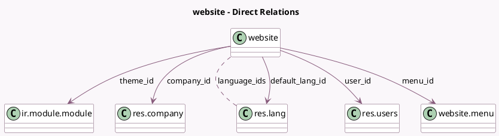

<!-- GENERATED:MODEL -->
---
tags: [odoo, community, generated, model]
---

# website

- Module: [[docs/Community Addons/website/website|website]]
- Scope: Community Addons
- Defined in module: yes
- Source files: `models/website.py`, `models/website_form.py`
- Python classes: `Website`
- Description: Website

## Field footprint

- Detected fields: 44
- Field types: `Binary` x 3, `Boolean` x 7, `Char` x 18, `Html` x 3, `Integer` x 2, `Many2many` x 1, `Many2one` x 6, `Selection` x 1, `Text` x 3
- Relation fields: 7

## Sample fields

- `auth_signup_uninvited`: `Selection`
- `auto_redirect_lang`: `Boolean` (comodel `Autoredirect Language`)
- `block_third_party_domains`: `Boolean` (comodel `Block 3rd-party domains`)
- `blocked_third_party_domains`: `Text` (comodel `List of blocked 3rd-party domains`, compute `_compute_blocked_third_party_domains`)
- `cdn_activated`: `Boolean` (comodel `Content Delivery Network (CDN)`)
- `cdn_filters`: `Text` (comodel `CDN Filters`)
- `cdn_url`: `Char` (comodel `CDN Base URL`)
- `company_id`: `Many2one` (comodel `res.company`)
- `configurator_done`: `Boolean`
- `cookies_bar`: `Boolean` (comodel `Cookies Bar`)
- `custom_blocked_third_party_domains`: `Text` (comodel `User list of blocked 3rd-party domains`)
- `custom_code_footer`: `Html` (comodel `Custom end of <body> code`)
- `custom_code_head`: `Html` (comodel `Custom <head> code`)
- `default_lang_id`: `Many2one` (comodel `res.lang`)
- `domain`: `Char` (comodel `Website Domain`)
- `domain_punycode`: `Char` (compute `_compute_domain_punycode`, store `False`)
- `favicon`: `Binary`
- `google_analytics_key`: `Char` (comodel `Google Analytics Key`)
- `google_maps_api_key`: `Char` (comodel `Google Maps API Key`)
- `google_search_console`: `Char`

## Method hints

- Detected methods: 105
- Action methods: `action_dashboard_redirect`
- Compute methods: `_compute_blocked_third_party_domains`, `_compute_domain_punycode`, `_compute_has_social_default_image`, `_compute_language_count`, `_compute_menu`
- Onchange methods: `_onchange_language_ids`

## Direct relation diagram

## Navigation

- **Parent:** [[docs/Community Addons/website/Models]]

<!-- GENERATED:MODEL -->
