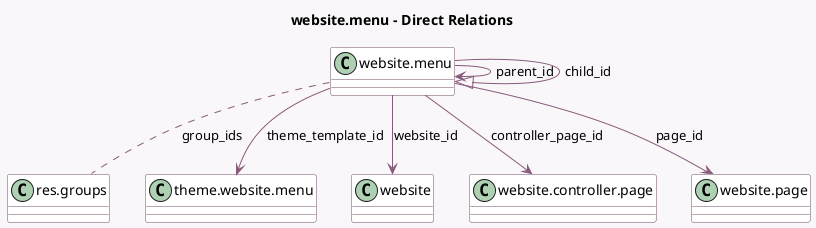

<!-- GENERATED:MODEL -->
---
tags: [odoo, community, generated, model]
---

# website.menu

- Module: [[docs/Community Addons/website/website|website]]
- Scope: Community Addons
- Defined in module: yes
- Source files: `models/theme_models.py`, `models/website_menu.py`
- Python classes: `WebsiteMenu`
- Description: Website Menu

## Field footprint

- Detected fields: 16
- Field types: `Boolean` x 3, `Char` x 4, `Html` x 1, `Integer` x 1, `Many2many` x 1, `Many2one` x 5, `One2many` x 1
- Relation fields: 7

## Sample fields

- `child_id`: `One2many` (comodel `website.menu`)
- `controller_page_id`: `Many2one` (comodel `website.controller.page`)
- `group_ids`: `Many2many` (comodel `res.groups`)
- `is_mega_menu`: `Boolean`
- `is_visible`: `Boolean` (compute `_compute_visible`)
- `mega_menu_classes`: `Char`
- `mega_menu_content`: `Html`
- `name`: `Char` (comodel `Menu`)
- `new_window`: `Boolean` (comodel `New Window`)
- `page_id`: `Many2one` (comodel `website.page`)
- `parent_id`: `Many2one` (comodel `website.menu`)
- `parent_path`: `Char`
- `sequence`: `Integer`
- `theme_template_id`: `Many2one` (comodel `theme.website.menu`)
- `url`: `Char` (comodel `Url`, compute `_compute_url`, store `True`)
- `website_id`: `Many2one` (comodel `website`)

## Method hints

- Detected methods: 15
- Action methods: none
- Compute methods: `_compute_display_name`, `_compute_field_is_mega_menu`, `_compute_url`, `_compute_visible`
- Onchange methods: none

## Direct relation diagram

## Navigation

- **Parent:** [[docs/Community Addons/website/Models]]

<!-- GENERATED:MODEL -->
