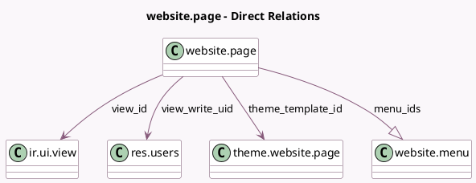

<!-- GENERATED:MODEL -->
---
tags: [odoo, community, generated, model]
---

# website.page

- Module: [[docs/Community Addons/website/website|website]]
- Scope: Community Addons
- Defined in module: yes
- Source files: `models/theme_models.py`, `models/website_page.py`
- Python classes: `WebsitePage`
- Description: Page
- Inherits: `website.page_options.mixin`, `website.published.multi.mixin`, `website.searchable.mixin`

## Field footprint

- Detected fields: 14
- Field types: `Boolean` x 5, `Char` x 1, `Datetime` x 2, `Many2one` x 4, `One2many` x 1, `Text` x 1
- Relation fields: 5

## Sample fields

- `arch`: `Text` (related `view_id.arch`)
- `date_publish`: `Datetime` (comodel `Publishing Date`)
- `is_homepage`: `Boolean` (compute `_compute_is_homepage`)
- `is_in_menu`: `Boolean` (compute `_compute_website_menu`)
- `is_new_page_template`: `Boolean`
- `is_visible`: `Boolean` (compute `_compute_visible`)
- `menu_ids`: `One2many` (comodel `website.menu`)
- `theme_template_id`: `Many2one` (comodel `theme.website.page`)
- `url`: `Char` (comodel `Page URL`)
- `view_id`: `Many2one` (comodel `ir.ui.view`)
- `view_write_date`: `Datetime` (comodel `Last Content Update on`, related `view_id.write_date`)
- `view_write_uid`: `Many2one` (comodel `res.users`, related `view_id.write_uid`)
- `website_id`: `Many2one` (related `view_id.website_id`, store `True`)
- `website_indexed`: `Boolean` (comodel `Is Indexed`)

## Method hints

- Detected methods: 14
- Action methods: `action_page_debug_view`
- Compute methods: `_compute_can_publish`, `_compute_is_homepage`, `_compute_visible`, `_compute_website_menu`, `_compute_website_url`
- Onchange methods: none

## Direct relation diagram

## Navigation

- **Parent:** [[docs/Community Addons/website/Models]]

<!-- GENERATED:MODEL -->
