<!-- GENERATED:MODEL -->
---
tags: [odoo, community, generated, model]
---

# website.page.properties.base

- Module: [[docs/Community Addons/website/website|website]]
- Scope: Community Addons
- Defined in module: yes
- Source files: `models/website_page_properties.py`
- Python classes: `WebsitePagePropertiesBase`
- Description: Page Properties Base

## Field footprint

- Detected fields: 8
- Field types: `Boolean` x 4, `Char` x 1, `Many2one` x 1, `One2many` x 1, `Reference` x 1
- Relation fields: 2

## Sample fields

- `can_publish`: `Boolean` (compute `_compute_can_publish`)
- `is_homepage`: `Boolean` (compute `_compute_is_homepage`)
- `is_in_menu`: `Boolean` (compute `_compute_is_in_menu`)
- `is_published`: `Boolean` (compute `_compute_is_published`)
- `menu_ids`: `One2many` (comodel `website.menu`, compute `_compute_menu_ids`)
- `target_model_id`: `Reference`
- `url`: `Char`
- `website_id`: `Many2one` (comodel `website`)

## Method hints

- Detected methods: 12
- Action methods: none
- Compute methods: `_compute_can_publish`, `_compute_is_homepage`, `_compute_is_in_menu`, `_compute_is_published`, `_compute_menu_ids`
- Onchange methods: none

## Direct relation diagram

```plantuml
@startuml
!define ODOO_COLOR_PRIMARY #714B67
!define ODOO_COLOR_ACCENT #875A7B
!define ODOO_COLOR_BG #FAF7FA

skinparam backgroundColor ODOO_COLOR_BG
skinparam defaultTextAlignment left
skinparam ArrowColor ODOO_COLOR_ACCENT
skinparam ClassBackgroundColor white
skinparam ClassBorderColor ODOO_COLOR_PRIMARY
skinparam ComponentBackgroundColor white
skinparam ComponentBorderColor ODOO_COLOR_PRIMARY
skinparam NoteBackgroundColor #FFF8FF
skinparam NoteBorderColor ODOO_COLOR_ACCENT
skinparam SequenceLifeLineBorderColor ODOO_COLOR_ACCENT
skinparam SequenceLifeLineBackgroundColor #FFFFFF
skinparam SequenceParticipantBorderColor ODOO_COLOR_PRIMARY
skinparam SequenceParticipantBackgroundColor #FFFFFF
skinparam sequence {
  ArrowColor ODOO_COLOR_ACCENT
  ActorBorderColor ODOO_COLOR_PRIMARY
}
title website.page.properties.base - Direct Relations
class "website.page.properties.base" as website_page_properties_base
class "website" as website
class "website.menu" as website_menu
website_page_properties_base --> website : website_id
website_page_properties_base --|> website_menu : menu_ids
@enduml
```

## Navigation

- **Parent:** [[docs/Community Addons/website/Models]]

<!-- GENERATED:MODEL -->
