<!-- GENERATED:MODEL -->
---
tags: [odoo, community, generated, model]
---

# website.page.properties

- Module: [[docs/Community Addons/website/website|website]]
- Scope: Community Addons
- Defined in module: yes
- Source files: `models/website_page_properties.py`
- Python classes: `WebsitePageProperties`
- Description: Page Properties
- Inherits: `website.page.properties.base`

## Field footprint

- Detected fields: 12
- Field types: `Boolean` x 3, `Char` x 4, `Datetime` x 1, `Many2many` x 1, `Many2one` x 1, `Selection` x 2
- Relation fields: 2

## Sample fields

- `date_publish`: `Datetime` (related `target_model_id.date_publish`)
- `group_ids`: `Many2many` (related `target_model_id.group_ids`)
- `is_new_page_template`: `Boolean` (related `target_model_id.is_new_page_template`)
- `name`: `Char` (related `target_model_id.name`)
- `old_url`: `Char`
- `redirect_old_url`: `Boolean` (store `False`)
- `redirect_type`: `Selection` (store `False`)
- `target_model_id`: `Many2one` (comodel `website.page`)
- `url`: `Char` (related `target_model_id.url`)
- `visibility`: `Selection` (related `target_model_id.visibility`)
- `visibility_password_display`: `Char` (related `target_model_id.visibility_password_display`)
- `website_indexed`: `Boolean` (related `target_model_id.website_indexed`)

## Method hints

- Detected methods: 3
- Action methods: none
- Compute methods: `_compute_is_homepage`
- Onchange methods: none

## Direct relation diagram

```plantuml
@startuml
!define ODOO_COLOR_PRIMARY #714B67
!define ODOO_COLOR_ACCENT #875A7B
!define ODOO_COLOR_BG #FAF7FA

skinparam backgroundColor ODOO_COLOR_BG
skinparam defaultTextAlignment left
skinparam ArrowColor ODOO_COLOR_ACCENT
skinparam ClassBackgroundColor white
skinparam ClassBorderColor ODOO_COLOR_PRIMARY
skinparam ComponentBackgroundColor white
skinparam ComponentBorderColor ODOO_COLOR_PRIMARY
skinparam NoteBackgroundColor #FFF8FF
skinparam NoteBorderColor ODOO_COLOR_ACCENT
skinparam SequenceLifeLineBorderColor ODOO_COLOR_ACCENT
skinparam SequenceLifeLineBackgroundColor #FFFFFF
skinparam SequenceParticipantBorderColor ODOO_COLOR_PRIMARY
skinparam SequenceParticipantBackgroundColor #FFFFFF
skinparam sequence {
  ArrowColor ODOO_COLOR_ACCENT
  ActorBorderColor ODOO_COLOR_PRIMARY
}
title website.page.properties - Direct Relations
class "website.page.properties" as website_page_properties
class "website.page" as website_page
website_page_properties --> website_page : target_model_id
@enduml
```

## Navigation

- **Parent:** [[docs/Community Addons/website/Models]]

<!-- GENERATED:MODEL -->
