<!-- GENERATED:MODEL -->
---
tags: [odoo, community, generated, model]
---

# website.snippet.filter

- Module: [[docs/Community Addons/website/website|website]]
- Scope: Community Addons
- Defined in module: yes
- Source files: `models/website_snippet_filter.py`
- Python classes: `WebsiteSnippetFilter`
- Description: Website Snippet Filter
- Inherits: `website.published.multi.mixin`

## Field footprint

- Detected fields: 8
- Field types: `Char` x 3, `Integer` x 1, `Many2one` x 3, `Text` x 1
- Relation fields: 3

## Sample fields

- `action_server_id`: `Many2one` (comodel `ir.actions.server`)
- `field_names`: `Char`
- `filter_id`: `Many2one` (comodel `ir.filters`)
- `help`: `Text`
- `limit`: `Integer`
- `model_name`: `Char` (compute `_compute_model_name`)
- `name`: `Char`
- `website_id`: `Many2one` (comodel `website`)

## Method hints

- Detected methods: 14
- Action methods: none
- Compute methods: `_compute_model_name`
- Onchange methods: none

## Direct relation diagram

```plantuml
@startuml
!define ODOO_COLOR_PRIMARY #714B67
!define ODOO_COLOR_ACCENT #875A7B
!define ODOO_COLOR_BG #FAF7FA

skinparam backgroundColor ODOO_COLOR_BG
skinparam defaultTextAlignment left
skinparam ArrowColor ODOO_COLOR_ACCENT
skinparam ClassBackgroundColor white
skinparam ClassBorderColor ODOO_COLOR_PRIMARY
skinparam ComponentBackgroundColor white
skinparam ComponentBorderColor ODOO_COLOR_PRIMARY
skinparam NoteBackgroundColor #FFF8FF
skinparam NoteBorderColor ODOO_COLOR_ACCENT
skinparam SequenceLifeLineBorderColor ODOO_COLOR_ACCENT
skinparam SequenceLifeLineBackgroundColor #FFFFFF
skinparam SequenceParticipantBorderColor ODOO_COLOR_PRIMARY
skinparam SequenceParticipantBackgroundColor #FFFFFF
skinparam sequence {
  ArrowColor ODOO_COLOR_ACCENT
  ActorBorderColor ODOO_COLOR_PRIMARY
}
title website.snippet.filter - Direct Relations
class "website.snippet.filter" as website_snippet_filter
class "ir.actions.server" as ir_actions_server
class "ir.filters" as ir_filters
class "website" as website
website_snippet_filter --> ir_actions_server : action_server_id
website_snippet_filter --> ir_filters : filter_id
website_snippet_filter --> website : website_id
@enduml
```

## Navigation

- **Parent:** [[docs/Community Addons/website/Models]]

<!-- GENERATED:MODEL -->
