<!-- GENERATED:MODEL -->
---
tags: [odoo, community, generated, model]
---

# website.track

- Module: [[docs/Community Addons/website/website|website]]
- Scope: Community Addons
- Defined in module: yes
- Source files: `models/website_visitor.py`
- Python classes: `WebsiteTrack`
- Description: Visited Pages

## Field footprint

- Detected fields: 4
- Field types: `Datetime` x 1, `Many2one` x 2, `Text` x 1
- Relation fields: 2

## Sample fields

- `page_id`: `Many2one` (comodel `website.page`)
- `url`: `Text` (comodel `Url`)
- `visit_datetime`: `Datetime` (comodel `Visit Date`)
- `visitor_id`: `Many2one` (comodel `website.visitor`)

## Method hints

- Detected methods: 0
- Action methods: none
- Compute methods: none
- Onchange methods: none

## Direct relation diagram

```plantuml
@startuml
!define ODOO_COLOR_PRIMARY #714B67
!define ODOO_COLOR_ACCENT #875A7B
!define ODOO_COLOR_BG #FAF7FA

skinparam backgroundColor ODOO_COLOR_BG
skinparam defaultTextAlignment left
skinparam ArrowColor ODOO_COLOR_ACCENT
skinparam ClassBackgroundColor white
skinparam ClassBorderColor ODOO_COLOR_PRIMARY
skinparam ComponentBackgroundColor white
skinparam ComponentBorderColor ODOO_COLOR_PRIMARY
skinparam NoteBackgroundColor #FFF8FF
skinparam NoteBorderColor ODOO_COLOR_ACCENT
skinparam SequenceLifeLineBorderColor ODOO_COLOR_ACCENT
skinparam SequenceLifeLineBackgroundColor #FFFFFF
skinparam SequenceParticipantBorderColor ODOO_COLOR_PRIMARY
skinparam SequenceParticipantBackgroundColor #FFFFFF
skinparam sequence {
  ArrowColor ODOO_COLOR_ACCENT
  ActorBorderColor ODOO_COLOR_PRIMARY
}
title website.track - Direct Relations
class "website.track" as website_track
class "website.page" as website_page
class "website.visitor" as website_visitor
website_track --> website_visitor : visitor_id
website_track --> website_page : page_id
@enduml
```

## Navigation

- **Parent:** [[docs/Community Addons/website/Models]]

<!-- GENERATED:MODEL -->
