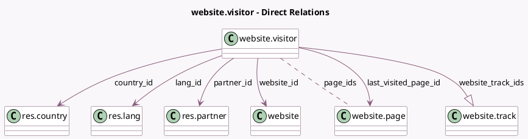

<!-- GENERATED:MODEL -->
---
tags: [odoo, community, generated, model]
---

# website.visitor

- Module: [[docs/Community Addons/website/website|website]]
- Scope: Community Addons
- Defined in module: yes
- Source files: `models/website_visitor.py`
- Python classes: `WebsiteVisitor`
- Description: Website Visitor

## Field footprint

- Detected fields: 21
- Field types: `Binary` x 1, `Boolean` x 1, `Char` x 6, `Datetime` x 2, `Integer` x 3, `Many2many` x 1, `Many2one` x 5, `One2many` x 1, `Selection` x 1
- Relation fields: 7

## Sample fields

- `access_token`: `Char`
- `country_flag`: `Char` (related `country_id.image_url`)
- `country_id`: `Many2one` (comodel `res.country`)
- `create_date`: `Datetime` (comodel `First Connection`)
- `email`: `Char` (compute `_compute_email_phone`)
- `is_connected`: `Boolean` (comodel `Is connected?`, compute `_compute_time_statistics`)
- `lang_id`: `Many2one` (comodel `res.lang`)
- `last_connection_datetime`: `Datetime` (comodel `Last Connection`)
- `last_visited_page_id`: `Many2one` (comodel `website.page`, compute `_compute_last_visited_page_id`)
- `mobile`: `Char` (compute `_compute_email_phone`)
- `name`: `Char` (comodel `Name`, related `partner_id.name`)
- `page_count`: `Integer` (comodel `# Visited Pages`, compute `_compute_page_statistics`)
- `page_ids`: `Many2many` (comodel `website.page`, compute `_compute_page_statistics`)
- `partner_id`: `Many2one` (comodel `res.partner`, compute `_compute_partner_id`, store `True`)
- `partner_image`: `Binary` (related `partner_id.image_1920`)
- `time_since_last_action`: `Char` (comodel `Last action`, compute `_compute_time_statistics`)
- `timezone`: `Selection`
- `visit_count`: `Integer` (comodel `# Visits`)
- `visitor_page_count`: `Integer` (comodel `Page Views`, compute `_compute_page_statistics`)
- `website_id`: `Many2one` (comodel `website`)

## Method hints

- Detected methods: 21
- Action methods: `action_send_mail`
- Compute methods: `_compute_display_name`, `_compute_email_phone`, `_compute_last_visited_page_id`, `_compute_page_statistics`, `_compute_partner_id`, `_compute_time_statistics`
- Onchange methods: none

## Direct relation diagram

## Navigation

- **Parent:** [[docs/Community Addons/website/Models]]

<!-- GENERATED:MODEL -->
