<!-- GENERATED:MODEL -->
---
tags: [odoo, community, generated, model]
---

# blog.blog

- Module: [[docs/Community Addons/website_blog/website_blog|website_blog]]
- Scope: Community Addons
- Defined in module: yes
- Source files: `models/website_blog.py`
- Python classes: `BlogBlog`
- Description: Blog
- Inherits: `mail.thread`, `website.cover_properties.mixin`, `website.multi.mixin`, `website.searchable.mixin`, `website.seo.metadata`

## Field footprint

- Detected fields: 7
- Field types: `Boolean` x 1, `Char` x 2, `Html` x 1, `Integer` x 2, `One2many` x 1
- Relation fields: 1

## Sample fields

- `active`: `Boolean` (comodel `Active`)
- `blog_post_count`: `Integer` (comodel `Posts`, compute `_compute_blog_post_count`)
- `blog_post_ids`: `One2many` (comodel `blog.post`)
- `content`: `Html` (comodel `Content`)
- `name`: `Char` (comodel `Blog Name`)
- `sequence`: `Integer` (comodel `Sequence`)
- `subtitle`: `Char` (comodel `Blog Subtitle`)

## Method hints

- Detected methods: 7
- Action methods: none
- Compute methods: `_compute_blog_post_count`
- Onchange methods: none

## Direct relation diagram

```plantuml
@startuml
!define ODOO_COLOR_PRIMARY #714B67
!define ODOO_COLOR_ACCENT #875A7B
!define ODOO_COLOR_BG #FAF7FA

skinparam backgroundColor ODOO_COLOR_BG
skinparam defaultTextAlignment left
skinparam ArrowColor ODOO_COLOR_ACCENT
skinparam ClassBackgroundColor white
skinparam ClassBorderColor ODOO_COLOR_PRIMARY
skinparam ComponentBackgroundColor white
skinparam ComponentBorderColor ODOO_COLOR_PRIMARY
skinparam NoteBackgroundColor #FFF8FF
skinparam NoteBorderColor ODOO_COLOR_ACCENT
skinparam SequenceLifeLineBorderColor ODOO_COLOR_ACCENT
skinparam SequenceLifeLineBackgroundColor #FFFFFF
skinparam SequenceParticipantBorderColor ODOO_COLOR_PRIMARY
skinparam SequenceParticipantBackgroundColor #FFFFFF
skinparam sequence {
  ArrowColor ODOO_COLOR_ACCENT
  ActorBorderColor ODOO_COLOR_PRIMARY
}
title blog.blog - Direct Relations
class "blog.blog" as blog_blog
class "blog.post" as blog_post
blog_blog --|> blog_post : blog_post_ids
@enduml
```

## Navigation

- **Parent:** [[docs/Community Addons/website_blog/Models]]

<!-- GENERATED:MODEL -->
