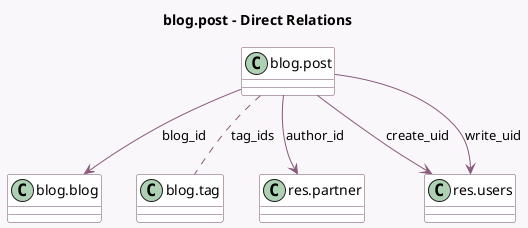

<!-- GENERATED:MODEL -->
---
tags: [odoo, community, generated, model]
---

# blog.post

- Module: [[docs/Community Addons/website_blog/website_blog|website_blog]]
- Scope: Community Addons
- Defined in module: yes
- Source files: `models/website_blog.py`
- Python classes: `BlogPost`
- Description: Blog Post
- Inherits: `mail.thread`, `website.cover_properties.mixin`, `website.page_visibility_options.mixin`, `website.published.multi.mixin`, `website.searchable.mixin`, `website.seo.metadata`

## Field footprint

- Detected fields: 20
- Field types: `Binary` x 1, `Boolean` x 1, `Char` x 3, `Datetime` x 4, `Html` x 1, `Integer` x 1, `Many2many` x 1, `Many2one` x 5, `One2many` x 1, `Text` x 2
- Relation fields: 7

## Sample fields

- `active`: `Boolean` (comodel `Active`)
- `author_avatar`: `Binary` (related `author_id.image_128`)
- `author_id`: `Many2one` (comodel `res.partner`)
- `author_name`: `Char` (related `author_id.display_name`, store `True`)
- `blog_id`: `Many2one` (comodel `blog.blog`)
- `content`: `Html` (comodel `Content`)
- `create_date`: `Datetime` (comodel `Created on`)
- `create_uid`: `Many2one` (comodel `res.users`)
- `name`: `Char` (comodel `Title`)
- `post_date`: `Datetime` (comodel `Publishing date`, compute `_compute_post_date`, store `True`)
- `published_date`: `Datetime` (comodel `Published Date`)
- `subtitle`: `Char` (comodel `Sub Title`)
- `tag_ids`: `Many2many` (comodel `blog.tag`)
- `teaser`: `Text` (comodel `Teaser`, compute `_compute_teaser`)
- `teaser_manual`: `Text`
- `visits`: `Integer` (comodel `No of Views`)
- `website_id`: `Many2one` (related `blog_id.website_id`, store `True`)
- `website_message_ids`: `One2many`
- `write_date`: `Datetime` (comodel `Last Updated on`)
- `write_uid`: `Many2one` (comodel `res.users`)

## Method hints

- Detected methods: 15
- Action methods: none
- Compute methods: `_compute_post_date`, `_compute_teaser`, `_compute_website_url`
- Onchange methods: none

## Direct relation diagram

## Navigation

- **Parent:** [[docs/Community Addons/website_blog/Models]]

<!-- GENERATED:MODEL -->
