<!-- GENERATED:MODEL -->
---
tags: [odoo, community, generated, model]
---

# blog.tag.category

- Module: [[docs/Community Addons/website_blog/website_blog|website_blog]]
- Scope: Community Addons
- Defined in module: yes
- Source files: `models/website_blog.py`
- Python classes: `BlogTagCategory`
- Description: Blog Tag Category

## Field footprint

- Detected fields: 2
- Field types: `Char` x 1, `One2many` x 1
- Relation fields: 1

## Sample fields

- `name`: `Char` (comodel `Name`)
- `tag_ids`: `One2many` (comodel `blog.tag`)

## Method hints

- Detected methods: 0
- Action methods: none
- Compute methods: none
- Onchange methods: none

## Direct relation diagram

```plantuml
@startuml
!define ODOO_COLOR_PRIMARY #714B67
!define ODOO_COLOR_ACCENT #875A7B
!define ODOO_COLOR_BG #FAF7FA

skinparam backgroundColor ODOO_COLOR_BG
skinparam defaultTextAlignment left
skinparam ArrowColor ODOO_COLOR_ACCENT
skinparam ClassBackgroundColor white
skinparam ClassBorderColor ODOO_COLOR_PRIMARY
skinparam ComponentBackgroundColor white
skinparam ComponentBorderColor ODOO_COLOR_PRIMARY
skinparam NoteBackgroundColor #FFF8FF
skinparam NoteBorderColor ODOO_COLOR_ACCENT
skinparam SequenceLifeLineBorderColor ODOO_COLOR_ACCENT
skinparam SequenceLifeLineBackgroundColor #FFFFFF
skinparam SequenceParticipantBorderColor ODOO_COLOR_PRIMARY
skinparam SequenceParticipantBackgroundColor #FFFFFF
skinparam sequence {
  ArrowColor ODOO_COLOR_ACCENT
  ActorBorderColor ODOO_COLOR_PRIMARY
}
title blog.tag.category - Direct Relations
class "blog.tag.category" as blog_tag_category
class "blog.tag" as blog_tag
blog_tag_category --|> blog_tag : tag_ids
@enduml
```

## Navigation

- **Parent:** [[docs/Community Addons/website_blog/Models]]

<!-- GENERATED:MODEL -->
