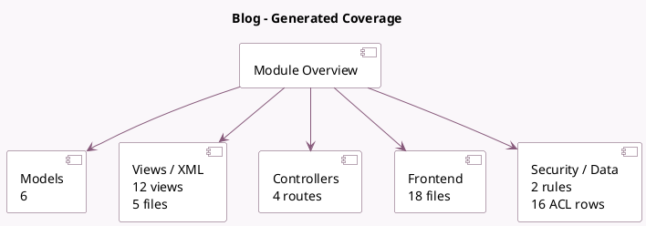

<!-- GENERATED:MODULE -->
---
tags: [odoo, community, module]
---

# Blog

- Scope: Community Addons
- Source: odoo/addons/website_blog
- Dependencies: [[docs/Community Addons/website_mail/website_mail|website_mail]], [[docs/Community Addons/website_partner/website_partner|website_partner]], [[docs/Community Addons/html_builder/html_builder|html_builder]]

## Summary

Publish blog posts, announces, news

## Generated coverage

- Models: 6
- XML files with UI/data artifacts: 5
- Views: 12
- Actions: 7
- Menus: 5
- Rules (ir.rule): 2
- Access CSV entries: 16
- Controller units: 1
- Frontend asset files: 18

## Module map

## Detail notes

- Models: [[docs/Community Addons/website_blog/Models|Models]] (6)
- Views and XML: [[docs/Community Addons/website_blog/Views|Views]] (5 files)
- Controllers: [[docs/Community Addons/website_blog/Controllers|Controllers]] (1)
- Frontend: [[docs/Community Addons/website_blog/Frontend|Frontend]] (18 files)

## Key models

- `blog.blog`
- `blog.post`
- `blog.tag`
- `blog.tag.category`
- `website`
- `website.snippet.filter`

## Navigation

- [[../Community Addons/Community Addons|Back to scope]]
- [[../../docs/docs|Back to docs]]

<!-- GENERATED:MODULE -->

