<!-- GENERATED:MODEL -->
---
tags: [odoo, community, generated, model]
---

# website

- Module: [[docs/Community Addons/website_crm/website_crm|website_crm]]
- Scope: Community Addons
- Defined in module: extension only
- Source files: `models/website.py`
- Python classes: `Website`

## Field footprint

- Detected fields: 2
- Field types: `Many2one` x 2
- Relation fields: 2

## Sample fields

- `crm_default_team_id`: `Many2one` (comodel `crm.team`)
- `crm_default_user_id`: `Many2one` (comodel `res.users`)

## Method hints

- Detected methods: 1
- Action methods: none
- Compute methods: none
- Onchange methods: none

## Direct relation diagram

```plantuml
@startuml
!define ODOO_COLOR_PRIMARY #714B67
!define ODOO_COLOR_ACCENT #875A7B
!define ODOO_COLOR_BG #FAF7FA

skinparam backgroundColor ODOO_COLOR_BG
skinparam defaultTextAlignment left
skinparam ArrowColor ODOO_COLOR_ACCENT
skinparam ClassBackgroundColor white
skinparam ClassBorderColor ODOO_COLOR_PRIMARY
skinparam ComponentBackgroundColor white
skinparam ComponentBorderColor ODOO_COLOR_PRIMARY
skinparam NoteBackgroundColor #FFF8FF
skinparam NoteBorderColor ODOO_COLOR_ACCENT
skinparam SequenceLifeLineBorderColor ODOO_COLOR_ACCENT
skinparam SequenceLifeLineBackgroundColor #FFFFFF
skinparam SequenceParticipantBorderColor ODOO_COLOR_PRIMARY
skinparam SequenceParticipantBackgroundColor #FFFFFF
skinparam sequence {
  ArrowColor ODOO_COLOR_ACCENT
  ActorBorderColor ODOO_COLOR_PRIMARY
}
title website - Direct Relations
class "website" as website
class "crm.team" as crm_team
class "res.users" as res_users
website --> crm_team : crm_default_team_id
website --> res_users : crm_default_user_id
@enduml
```

## Navigation

- **Parent:** [[docs/Community Addons/website_crm/Models]]

<!-- GENERATED:MODEL -->
