<!-- GENERATED:MODEL -->
---
tags: [odoo, community, generated, model]
---

# crm.reveal.rule

- Module: [[docs/Community Addons/website_crm_iap_reveal/website_crm_iap_reveal|website_crm_iap_reveal]]
- Scope: Community Addons
- Defined in module: yes
- Source files: `models/crm_reveal_rule.py`
- Python classes: `CrmRevealRule`
- Description: CRM Lead Generation Rules

## Field footprint

- Detected fields: 26
- Field types: `Boolean` x 2, `Char` x 3, `Integer` x 6, `Many2many` x 5, `Many2one` x 5, `One2many` x 1, `Selection` x 4
- Relation fields: 11

## Sample fields

- `active`: `Boolean`
- `company_size_max`: `Integer`
- `company_size_min`: `Integer`
- `contact_filter_type`: `Selection`
- `country_ids`: `Many2many` (comodel `res.country`)
- `extra_contacts`: `Integer`
- `filter_on_size`: `Boolean`
- `industry_tag_ids`: `Many2many` (comodel `crm.iap.lead.industry`)
- `lead_count`: `Integer` (compute `_compute_lead_count`)
- `lead_for`: `Selection`
- `lead_ids`: `One2many` (comodel `crm.lead`)
- `lead_type`: `Selection`
- `name`: `Char`
- `opportunity_count`: `Integer` (compute `_compute_lead_count`)
- `other_role_ids`: `Many2many` (comodel `crm.iap.lead.role`)
- `preferred_role_id`: `Many2one` (comodel `crm.iap.lead.role`)
- `priority`: `Selection`
- `regex_url`: `Char`
- `seniority_id`: `Many2one` (comodel `crm.iap.lead.seniority`)
- `sequence`: `Integer`

## Method hints

- Detected methods: 19
- Action methods: `action_get_lead_tree_view`, `action_get_opportunity_tree_view`
- Compute methods: `_compute_lead_count`
- Onchange methods: none

## Direct relation diagram

```plantuml
@startuml
!define ODOO_COLOR_PRIMARY #714B67
!define ODOO_COLOR_ACCENT #875A7B
!define ODOO_COLOR_BG #FAF7FA

skinparam backgroundColor ODOO_COLOR_BG
skinparam defaultTextAlignment left
skinparam ArrowColor ODOO_COLOR_ACCENT
skinparam ClassBackgroundColor white
skinparam ClassBorderColor ODOO_COLOR_PRIMARY
skinparam ComponentBackgroundColor white
skinparam ComponentBorderColor ODOO_COLOR_PRIMARY
skinparam NoteBackgroundColor #FFF8FF
skinparam NoteBorderColor ODOO_COLOR_ACCENT
skinparam SequenceLifeLineBorderColor ODOO_COLOR_ACCENT
skinparam SequenceLifeLineBackgroundColor #FFFFFF
skinparam SequenceParticipantBorderColor ODOO_COLOR_PRIMARY
skinparam SequenceParticipantBackgroundColor #FFFFFF
skinparam sequence {
  ArrowColor ODOO_COLOR_ACCENT
  ActorBorderColor ODOO_COLOR_PRIMARY
}
title crm.reveal.rule - Direct Relations
class "crm.reveal.rule" as crm_reveal_rule
class "crm.iap.lead.industry" as crm_iap_lead_industry
class "crm.iap.lead.role" as crm_iap_lead_role
class "crm.iap.lead.seniority" as crm_iap_lead_seniority
class "crm.lead" as crm_lead
class "crm.tag" as crm_tag
class "crm.team" as crm_team
class "res.country" as res_country
class "res.country.state" as res_country_state
class "res.users" as res_users
class "website" as website
crm_reveal_rule .. res_country : country_ids
crm_reveal_rule --> website : website_id
crm_reveal_rule .. res_country_state : state_ids
crm_reveal_rule .. crm_iap_lead_industry : industry_tag_ids
crm_reveal_rule --> crm_iap_lead_role : preferred_role_id
crm_reveal_rule .. crm_iap_lead_role : other_role_ids
crm_reveal_rule --> crm_iap_lead_seniority : seniority_id
crm_reveal_rule --> crm_team : team_id
crm_reveal_rule .. crm_tag : tag_ids
crm_reveal_rule --> res_users : user_id
crm_reveal_rule --|> crm_lead : lead_ids
@enduml
```

## Navigation

- **Parent:** [[docs/Community Addons/website_crm_iap_reveal/Models]]

<!-- GENERATED:MODEL -->
