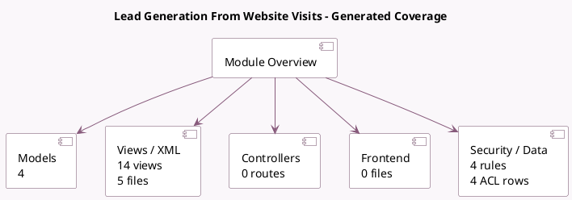

<!-- GENERATED:MODULE -->
---
tags: [odoo, community, module]
---

# Lead Generation From Website Visits

- Scope: Community Addons
- Source: odoo/addons/website_crm_iap_reveal
- Dependencies: [[docs/Community Addons/iap_crm/iap_crm|iap_crm]], [[docs/Community Addons/iap_mail/iap_mail|iap_mail]], [[docs/Community Addons/crm_iap_mine/crm_iap_mine|crm_iap_mine]], [[docs/Community Addons/website_crm/website_crm|website_crm]]

## Summary

Generate Leads/Opportunities from your website's traffic

## Generated coverage

- Models: 4
- XML files with UI/data artifacts: 5
- Views: 14
- Actions: 2
- Menus: 2
- Rules (ir.rule): 4
- Access CSV entries: 4
- Controller units: 0
- Frontend asset files: 0

## Module map

## Detail notes

- Models: [[docs/Community Addons/website_crm_iap_reveal/Models|Models]] (4)
- Views and XML: [[docs/Community Addons/website_crm_iap_reveal/Views|Views]] (5 files)

## Key models

- `crm.lead`
- `crm.reveal.rule`
- `crm.reveal.view`
- `ir.http`

## Navigation

- [[../Community Addons/Community Addons|Back to scope]]
- [[../../docs/docs|Back to docs]]

<!-- GENERATED:MODULE -->

