<!-- GENERATED:MODEL -->
---
tags: [odoo, community, generated, model]
---

# crm.lead.assignation

- Module: [[docs/Community Addons/website_crm_partner_assign/website_crm_partner_assign|website_crm_partner_assign]]
- Scope: Community Addons
- Defined in module: yes
- Source files: `wizard/crm_forward_to_partner.py`
- Python classes: `CrmLeadAssignation`
- Description: Lead Assignation

## Field footprint

- Detected fields: 6
- Field types: `Char` x 3, `Many2one` x 3
- Relation fields: 3

## Sample fields

- `forward_id`: `Many2one` (comodel `crm.lead.forward.to.partner`)
- `lead_id`: `Many2one` (comodel `crm.lead`)
- `lead_link`: `Char` (comodel `Link to Lead`)
- `lead_location`: `Char` (comodel `Lead Location`)
- `partner_assigned_id`: `Many2one` (comodel `res.partner`)
- `partner_location`: `Char` (comodel `Partner Location`)

## Method hints

- Detected methods: 2
- Action methods: none
- Compute methods: none
- Onchange methods: `_onchange_lead_id`, `_onchange_partner_assigned_id`

## Direct relation diagram

```plantuml
@startuml
!define ODOO_COLOR_PRIMARY #714B67
!define ODOO_COLOR_ACCENT #875A7B
!define ODOO_COLOR_BG #FAF7FA

skinparam backgroundColor ODOO_COLOR_BG
skinparam defaultTextAlignment left
skinparam ArrowColor ODOO_COLOR_ACCENT
skinparam ClassBackgroundColor white
skinparam ClassBorderColor ODOO_COLOR_PRIMARY
skinparam ComponentBackgroundColor white
skinparam ComponentBorderColor ODOO_COLOR_PRIMARY
skinparam NoteBackgroundColor #FFF8FF
skinparam NoteBorderColor ODOO_COLOR_ACCENT
skinparam SequenceLifeLineBorderColor ODOO_COLOR_ACCENT
skinparam SequenceLifeLineBackgroundColor #FFFFFF
skinparam SequenceParticipantBorderColor ODOO_COLOR_PRIMARY
skinparam SequenceParticipantBackgroundColor #FFFFFF
skinparam sequence {
  ArrowColor ODOO_COLOR_ACCENT
  ActorBorderColor ODOO_COLOR_PRIMARY
}
title crm.lead.assignation - Direct Relations
class "crm.lead.assignation" as crm_lead_assignation
class "crm.lead" as crm_lead
class "crm.lead.forward.to.partner" as crm_lead_forward_to_partner
class "res.partner" as res_partner
crm_lead_assignation --> crm_lead_forward_to_partner : forward_id
crm_lead_assignation --> crm_lead : lead_id
crm_lead_assignation --> res_partner : partner_assigned_id
@enduml
```

## Navigation

- **Parent:** [[docs/Community Addons/website_crm_partner_assign/Models]]

<!-- GENERATED:MODEL -->
