<!-- GENERATED:MODEL -->
---
tags: [odoo, community, generated, model]
---

# crm.lead.forward.to.partner

- Module: [[docs/Community Addons/website_crm_partner_assign/website_crm_partner_assign|website_crm_partner_assign]]
- Scope: Community Addons
- Defined in module: yes
- Source files: `wizard/crm_forward_to_partner.py`
- Python classes: `CrmLeadForwardToPartner`
- Description: Lead forward to partner

## Field footprint

- Detected fields: 4
- Field types: `Html` x 1, `Many2one` x 1, `One2many` x 1, `Selection` x 1
- Relation fields: 2

## Sample fields

- `assignation_lines`: `One2many` (comodel `crm.lead.assignation`)
- `body`: `Html` (comodel `Contents`)
- `forward_type`: `Selection`
- `partner_id`: `Many2one` (comodel `res.partner`)

## Method hints

- Detected methods: 4
- Action methods: `action_forward`
- Compute methods: none
- Onchange methods: none

## Direct relation diagram

```plantuml
@startuml
!define ODOO_COLOR_PRIMARY #714B67
!define ODOO_COLOR_ACCENT #875A7B
!define ODOO_COLOR_BG #FAF7FA

skinparam backgroundColor ODOO_COLOR_BG
skinparam defaultTextAlignment left
skinparam ArrowColor ODOO_COLOR_ACCENT
skinparam ClassBackgroundColor white
skinparam ClassBorderColor ODOO_COLOR_PRIMARY
skinparam ComponentBackgroundColor white
skinparam ComponentBorderColor ODOO_COLOR_PRIMARY
skinparam NoteBackgroundColor #FFF8FF
skinparam NoteBorderColor ODOO_COLOR_ACCENT
skinparam SequenceLifeLineBorderColor ODOO_COLOR_ACCENT
skinparam SequenceLifeLineBackgroundColor #FFFFFF
skinparam SequenceParticipantBorderColor ODOO_COLOR_PRIMARY
skinparam SequenceParticipantBackgroundColor #FFFFFF
skinparam sequence {
  ArrowColor ODOO_COLOR_ACCENT
  ActorBorderColor ODOO_COLOR_PRIMARY
}
title crm.lead.forward.to.partner - Direct Relations
class "crm.lead.forward.to.partner" as crm_lead_forward_to_partner
class "crm.lead.assignation" as crm_lead_assignation
class "res.partner" as res_partner
crm_lead_forward_to_partner --> res_partner : partner_id
crm_lead_forward_to_partner --|> crm_lead_assignation : assignation_lines
@enduml
```

## Navigation

- **Parent:** [[docs/Community Addons/website_crm_partner_assign/Models]]

<!-- GENERATED:MODEL -->
