<!-- GENERATED:MODEL -->
---
tags: [odoo, community, generated, model]
---

# crm.lead

- Module: [[docs/Community Addons/website_crm_partner_assign/website_crm_partner_assign|website_crm_partner_assign]]
- Scope: Community Addons
- Defined in module: extension only
- Source files: `models/crm_lead.py`
- Python classes: `CrmLead`

## Field footprint

- Detected fields: 5
- Field types: `Date` x 1, `Float` x 2, `Many2many` x 1, `Many2one` x 1
- Relation fields: 2

## Sample fields

- `date_partner_assign`: `Date` (comodel `Partner Assignment Date`, compute `_compute_date_partner_assign`, store `True`)
- `partner_assigned_id`: `Many2one` (comodel `res.partner`)
- `partner_declined_ids`: `Many2many` (comodel `res.partner`)
- `partner_latitude`: `Float` (comodel `Geo Latitude`)
- `partner_longitude`: `Float` (comodel `Geo Longitude`)

## Method hints

- Detected methods: 14
- Action methods: `action_assign_partner`
- Compute methods: `_compute_date_partner_assign`
- Onchange methods: none

## Direct relation diagram

```plantuml
@startuml
!define ODOO_COLOR_PRIMARY #714B67
!define ODOO_COLOR_ACCENT #875A7B
!define ODOO_COLOR_BG #FAF7FA

skinparam backgroundColor ODOO_COLOR_BG
skinparam defaultTextAlignment left
skinparam ArrowColor ODOO_COLOR_ACCENT
skinparam ClassBackgroundColor white
skinparam ClassBorderColor ODOO_COLOR_PRIMARY
skinparam ComponentBackgroundColor white
skinparam ComponentBorderColor ODOO_COLOR_PRIMARY
skinparam NoteBackgroundColor #FFF8FF
skinparam NoteBorderColor ODOO_COLOR_ACCENT
skinparam SequenceLifeLineBorderColor ODOO_COLOR_ACCENT
skinparam SequenceLifeLineBackgroundColor #FFFFFF
skinparam SequenceParticipantBorderColor ODOO_COLOR_PRIMARY
skinparam SequenceParticipantBackgroundColor #FFFFFF
skinparam sequence {
  ArrowColor ODOO_COLOR_ACCENT
  ActorBorderColor ODOO_COLOR_PRIMARY
}
title crm.lead - Direct Relations
class "crm.lead" as crm_lead
class "res.partner" as res_partner
crm_lead --> res_partner : partner_assigned_id
crm_lead .. res_partner : partner_declined_ids
@enduml
```

## Navigation

- **Parent:** [[docs/Community Addons/website_crm_partner_assign/Models]]

<!-- GENERATED:MODEL -->
