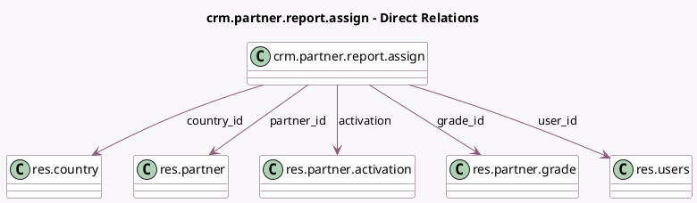

<!-- GENERATED:MODEL -->
---
tags: [odoo, community, generated, model]
---

# crm.partner.report.assign

- Module: [[docs/Community Addons/website_crm_partner_assign/website_crm_partner_assign|website_crm_partner_assign]]
- Scope: Community Addons
- Defined in module: yes
- Source files: `report/crm_partner_report.py`
- Python classes: `CrmPartnerReportAssign`
- Description: CRM Partnership Analysis

## Field footprint

- Detected fields: 10
- Field types: `Date` x 3, `Float` x 1, `Integer` x 1, `Many2one` x 5
- Relation fields: 5

## Sample fields

- `activation`: `Many2one` (comodel `res.partner.activation`)
- `country_id`: `Many2one` (comodel `res.country`)
- `date`: `Date` (comodel `Invoice Account Date`)
- `date_partnership`: `Date` (comodel `Partnership Date`)
- `date_review`: `Date` (comodel `Latest Partner Review`)
- `grade_id`: `Many2one` (comodel `res.partner.grade`)
- `nbr_opportunities`: `Integer` (comodel `# of Opportunity`)
- `partner_id`: `Many2one` (comodel `res.partner`)
- `turnover`: `Float` (comodel `Turnover`)
- `user_id`: `Many2one` (comodel `res.users`)

## Method hints

- Detected methods: 1
- Action methods: none
- Compute methods: none
- Onchange methods: none

## Direct relation diagram

## Navigation

- **Parent:** [[docs/Community Addons/website_crm_partner_assign/Models]]

<!-- GENERATED:MODEL -->
