<!-- GENERATED:MODEL -->
---
tags: [odoo, community, generated, model]
---

# res.partner

- Module: [[docs/Community Addons/website_crm_partner_assign/website_crm_partner_assign|website_crm_partner_assign]]
- Scope: Community Addons
- Defined in module: extension only
- Source files: `models/res_partner.py`
- Python classes: `ResPartner`

## Field footprint

- Detected fields: 9
- Field types: `Date` x 3, `Integer` x 3, `Many2one` x 2, `One2many` x 1
- Relation fields: 3

## Sample fields

- `activation`: `Many2one` (comodel `res.partner.activation`)
- `assigned_partner_id`: `Many2one` (comodel `res.partner`)
- `date_partnership`: `Date` (comodel `Partnership Date`)
- `date_review`: `Date` (comodel `Latest Review`)
- `date_review_next`: `Date` (comodel `Next Review`)
- `grade_sequence`: `Integer` (related `grade_id.sequence`, store `True`)
- `implemented_partner_count`: `Integer` (compute `_compute_implemented_partner_count`, store `True`)
- `implemented_partner_ids`: `One2many` (comodel `res.partner`)
- `partner_weight`: `Integer` (comodel `Level Weight`, compute `_compute_partner_weight`, store `True`)

## Method hints

- Detected methods: 5
- Action methods: none
- Compute methods: `_compute_implemented_partner_count`, `_compute_opportunity_count`, `_compute_partner_weight`
- Onchange methods: none

## Direct relation diagram

```plantuml
@startuml
!define ODOO_COLOR_PRIMARY #714B67
!define ODOO_COLOR_ACCENT #875A7B
!define ODOO_COLOR_BG #FAF7FA

skinparam backgroundColor ODOO_COLOR_BG
skinparam defaultTextAlignment left
skinparam ArrowColor ODOO_COLOR_ACCENT
skinparam ClassBackgroundColor white
skinparam ClassBorderColor ODOO_COLOR_PRIMARY
skinparam ComponentBackgroundColor white
skinparam ComponentBorderColor ODOO_COLOR_PRIMARY
skinparam NoteBackgroundColor #FFF8FF
skinparam NoteBorderColor ODOO_COLOR_ACCENT
skinparam SequenceLifeLineBorderColor ODOO_COLOR_ACCENT
skinparam SequenceLifeLineBackgroundColor #FFFFFF
skinparam SequenceParticipantBorderColor ODOO_COLOR_PRIMARY
skinparam SequenceParticipantBackgroundColor #FFFFFF
skinparam sequence {
  ArrowColor ODOO_COLOR_ACCENT
  ActorBorderColor ODOO_COLOR_PRIMARY
}
title res.partner - Direct Relations
class "res.partner" as res_partner
class "res.partner" as res_partner
class "res.partner.activation" as res_partner_activation
res_partner --> res_partner_activation : activation
res_partner --> res_partner : assigned_partner_id
res_partner --|> res_partner : implemented_partner_ids
@enduml
```

## Navigation

- **Parent:** [[docs/Community Addons/website_crm_partner_assign/Models]]

<!-- GENERATED:MODEL -->
