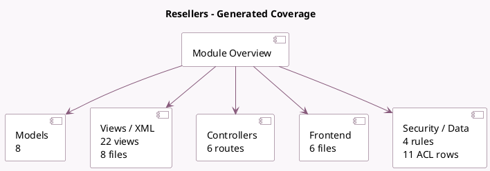

<!-- GENERATED:MODULE -->
---
tags: [odoo, community, module]
---

# Resellers

- Scope: Community Addons
- Source: odoo/addons/website_crm_partner_assign
- Dependencies: [[docs/Community Addons/base_geolocalize/base_geolocalize|base_geolocalize]], [[docs/Community Addons/crm/crm|crm]], [[docs/Community Addons/account/account|account]], [[docs/Community Addons/partnership/partnership|partnership]], [[docs/Community Addons/website_partner/website_partner|website_partner]], [[docs/Community Addons/website_google_map/website_google_map|website_google_map]], [[docs/Community Addons/portal/portal|portal]]

## Summary

Publish your resellers/partners and forward leads to them

## Generated coverage

- Models: 8
- XML files with UI/data artifacts: 8
- Views: 22
- Actions: 4
- Menus: 2
- Rules (ir.rule): 4
- Access CSV entries: 11
- Controller units: 2
- Frontend asset files: 6

## Module map

## Detail notes

- Models: [[docs/Community Addons/website_crm_partner_assign/Models|Models]] (8)
- Views and XML: [[docs/Community Addons/website_crm_partner_assign/Views|Views]] (8 files)
- Controllers: [[docs/Community Addons/website_crm_partner_assign/Controllers|Controllers]] (2)
- Frontend: [[docs/Community Addons/website_crm_partner_assign/Frontend|Frontend]] (6 files)

## Key models

- `crm.lead`
- `crm.lead.assignation`
- `crm.lead.forward.to.partner`
- `crm.partner.report.assign`
- `res.partner`
- `res.partner.activation`
- `res.partner.grade`
- `website`

## Navigation

- [[../Community Addons/Community Addons|Back to scope]]
- [[../../docs/docs|Back to docs]]

<!-- GENERATED:MODULE -->

