<!-- GENERATED:MODEL -->
---
tags: [odoo, community, generated, model]
---

# res.partner.tag

- Module: [[docs/Community Addons/website_customer/website_customer|website_customer]]
- Scope: Community Addons
- Defined in module: yes
- Source files: `models/res_partner.py`
- Python classes: `ResPartnerTag`
- Description: Partner Tags - These tags can be used on website to find customers by sector, or ...
- Inherits: `website.published.mixin`

## Field footprint

- Detected fields: 4
- Field types: `Boolean` x 1, `Char` x 1, `Many2many` x 1, `Selection` x 1
- Relation fields: 1

## Sample fields

- `active`: `Boolean` (comodel `Active`)
- `classname`: `Selection` (comodel `get_selection_class`)
- `name`: `Char` (comodel `Category Name`)
- `partner_ids`: `Many2many` (comodel `res.partner`)

## Method hints

- Detected methods: 2
- Action methods: none
- Compute methods: none
- Onchange methods: none

## Direct relation diagram

```plantuml
@startuml
!define ODOO_COLOR_PRIMARY #714B67
!define ODOO_COLOR_ACCENT #875A7B
!define ODOO_COLOR_BG #FAF7FA

skinparam backgroundColor ODOO_COLOR_BG
skinparam defaultTextAlignment left
skinparam ArrowColor ODOO_COLOR_ACCENT
skinparam ClassBackgroundColor white
skinparam ClassBorderColor ODOO_COLOR_PRIMARY
skinparam ComponentBackgroundColor white
skinparam ComponentBorderColor ODOO_COLOR_PRIMARY
skinparam NoteBackgroundColor #FFF8FF
skinparam NoteBorderColor ODOO_COLOR_ACCENT
skinparam SequenceLifeLineBorderColor ODOO_COLOR_ACCENT
skinparam SequenceLifeLineBackgroundColor #FFFFFF
skinparam SequenceParticipantBorderColor ODOO_COLOR_PRIMARY
skinparam SequenceParticipantBackgroundColor #FFFFFF
skinparam sequence {
  ArrowColor ODOO_COLOR_ACCENT
  ActorBorderColor ODOO_COLOR_PRIMARY
}
title res.partner.tag - Direct Relations
class "res.partner.tag" as res_partner_tag
class "res.partner" as res_partner
res_partner_tag .. res_partner : partner_ids
@enduml
```

## Navigation

- **Parent:** [[docs/Community Addons/website_customer/Models]]

<!-- GENERATED:MODEL -->
